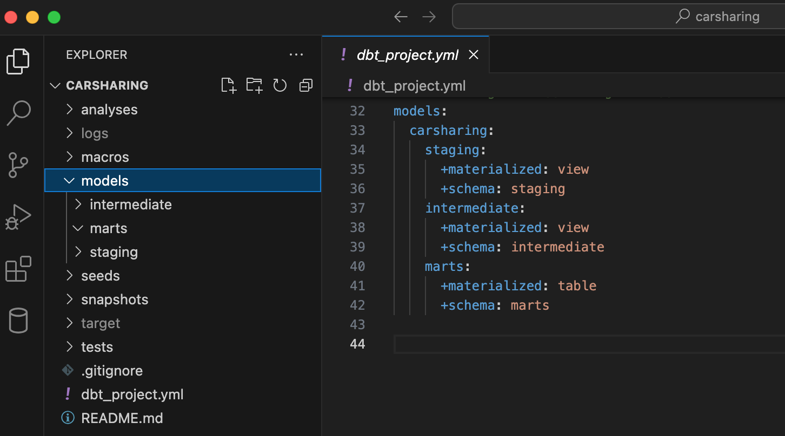

Проект будет представлять собой традиционное хранилище данных с трехуровневой архитектурой:

1. Первичные данные - уровень, который содержит транзакционные данные одного или нескольких источников в неизменном виде.

2. Ядро хранилища – основной уровень, где происходит очистка исходных данных, их преобразование в структуру, удовлетворяющую потребностям бизнеса.

3. Аналитические витрины - уровень представления данных для проведения анализа по определенной бизнес-специфике с помощью отчетности, дашбордов и т.д.

Архитектура dbt-проекта соответствует принципу «слоенного пирога» хранилища данных.

Слои хранилища создаются в папке `models` в качестве подпапок, а также в виде настройки в файле `dbt_project.yml`.

Для начала немного ознакомимся со слоями dbt-проекта, которые идут в порядке преобразования данных, а затем перейдем к их созданию.

## **Слои хранилища (проекта)**

Разработчиками (dbt Labs) рекомендованы следующие слои (папки) dbt-проекта:

-  Слой первичных данных (staging)

-  Промежуточный слой (intermediate)

-  Слой витрин данных (marts)

При этом рекомендуется для каждого слоя создавать отдельную схему на уровне платформы (базы данных).

### **Слой первичных данных (staging)**

Слой первичных данных содержит исходные модели, которые повторяют источники данных один к одному. Здесь не выполняются никакие преобразования данных.

Основная задача этого слоя – подготовка фундамента для построения хранилища. Максимум, что можно здесь сделать – провести небольшую очистку и подготовку таблиц для дальнейшего использования. Например, переименовать некоторые поля исходных таблиц, привести типы каких-то полей и т.д. Агрегирование и джоины – задачи других слоев.

Правилом хорошего тона также является структурирование папок с исходными моделями по названию систем-источников. Если для хранилища используются несколько баз данных (например, postgresql и mysql), то папка `staging` может содержать подпапки с названиями источников (`staging/postgresql` и `staging/mysql`). Такая группировка позволит избежать путаницы в наименованиях, так как разные источники могут содержать похожие сущности.

Исходя из группировки источников, формируются правила наименования моделей слоя первичных данных.

Во-первых, имена должны быть уникальными, а во-вторых, должны включать в себя, как можно больше четкой информации, которая позволит однозначно определить назначение модели.

Правило наименование моделей этого слоя следующее:

`stg_[source]__[entity]s.sql`

, где

-  `stg` - префикс слоя (staging),

-  `source` – имя подпапки с названием источника,

-  `entity` – имя сущности.

<note type="lab" title="Примечание">

1. Имя источника отделено от имени сущности двойным подчеркиванием. Это помогает визуально выделить имя сущности, на тот случай, если имя источника состоит из нескольких слов (например, для `stg_my_first_system__[entity]s.sql`).

2. Имя сущности используется во множественном числе (например, имя сущности в названии модели с данными о заказчиках следует указывать не `customer`, а `customers` - `stg_my_first_system__customers.sql`).

</note>

Несколько слов о материализации данных.

Поскольку модели слоя первичных данных не предназначены для запроса конечными потребителями данных, то эти модели создаются как представления. Такой выбор варианта материализации обусловлен также следующими соображениями:

1. Модели staging-слоя являются фундаментом хранилища. Это значит, что все последующие по потоку данных модели напрямую или косвенно обращаются к моделям первичного слоя. Следовательно, имея источник в виде представлений, модели последующих слоев всегда будут содержать актуальные данные, которые предоставляют системы-источники.

2. Использование staging-моделей в виде представлений позволяет сэкономить место в хранилище на модели, которые не предназначены для запросов потребителей данных.

### **Промежуточный слой (intermediate)**

Промежуточный слой – это то место, где модели исходного слоя объединяются и создают новый разрез данных в соответствии с логикой и потребностями бизнеса. Именно здесь выполняются джоины и агрегирование, обеспечивается качество, целостность и полнота данных.

Так же, как и модели staging-слоя, модели промежуточного слоя для порядка должны быть сгруппированы в подпапки. Но в отличии от слоя первичных данных, организация подпапок промежуточного слоя ориентирована не на системы-источники, а на бизнес-структуру.

Если данные хранилища используются несколькими подразделениями компании (например, финансовый, сервисный и другие отделы), то папка `intermediate` может содержать подпапки с названиями этих подразделений (`intermediate/finance`, `intermediate/service` и т. д.).

<note type="lab" title="Примечание">

В хранилище могут быть сущности, которые используются несколькими подразделениями, поэтому нет смысла дублировать их в каждой подпапке. Например, заказчики (customers). В этом случае, создается общая папка `intermediate/core` для хранения таких моделей.

</note>

Разнообразие преобразований на промежуточном слое затрудняет строгое определение наименования моделей. Но так как все преобразования – это набор каких-то действий, то используйте в имени модели глаголы, обозначающие эти действия.

Придерживайтесь следующего рекомендованного шаблона наименования моделей:

`int_[entity]s_[verb].sql`

, где

-  `int` - префикс слоя,

-  `entity` – имя сущности,

-  `verb` – глагол, обозначающий действие по преобразованию данных (например, joined, aggregated).

В результате имя модели на промежуточном слое может быть примерно таким: `int_payments_joined_to_bookings.sql`.

Такое наименование позволит любому сотруднику компании, даже плохо знающему SQL (и немного владеющим английским), сразу понять суть преобразований в модели. Длинное название ни коим образом не должно смущать. Чем больше информации, тем понятнее.

Если говорить о типе материализации на данном уровне, то здесь рекомендуется применять эфемерные модели, которые не создаются физически в хранилище данных и используются в моделях текущего и других слоев в виде обобщенных табличных выражений или common table expressions (CTE).

Такой выбор типа материализации сделан, исходя из того, что модели промежуточного слоя не запрашиваются потребителями напрямую и служат для применения бизнес-логики и последующего физического сохранения на слое витрин. Но конечно же могут возникать исключения. Если требуется сохранить результат одной или нескольких промежуточных моделей, то вы можете выполнить такую настройку непосредственно на уровне модели.

<note type="lab" title="Примечание">

Настройки на уровне модели имеют приоритет над настройками на уровне проекта.

</note>

Еще несколько слов о промежуточных моделях.

Так как их основное назначение – упрощение сложных преобразований данных, то существуют следующие рекомендации для работы с моделями промежуточного слоя:

1. Используйте в одной промежуточной модели разумное количество сущностей (моделей слоя первичных данных и/или других моделей промежуточного слоя). Ограничьтесь максимум 6 сущностями – это позволит не только лучше и быстрее понять процесс преобразования, но также отлаживать и тестировать модели.

2. Используйте промежуточные модели для создания нужного уровня гранулированности данных. Допустим, что требуется обогатить модель `Orders` определенной информацией из модели `Customers`. Выполните данное преобразование в отдельной модели и затем используйте ее в других моделях потока на текущем слое.

### **Слой витрин данных (marts)**

На слое витрин данных ранее созданные модели (как правило, все-таки промежуточные, но бывают, что также участвуют исходные) объединяются для формирования сущностей, каждая из которых предназначена для определенной цели. Например, заказчики, оплата и т.д. – все эти сущности представляют собой отдельные модели.

Слой витрин наследует организацию подпапок промежуточного слоя, ориентированную на бизнес-структуру – `marts/finance`, `marts/service` и т.д., а также директорию для общих сущностей – `marts/core`.

В отличие от моделей предыдущих слоев наименования моделей витрин не задаются определенными шаблонами. Просто давайте наименования, отражающие однозначное понимание сущности (например, `Customers`, `Orders` и т.д.). Но так как в учебном проекте выбрана парадигма Кимбалла с таблицами измерений и фактов, то наименования моделей будут с префиксами `dim` и `fct` соответсвенно (например, `dim_cars`, `fct_payment`).

Так как витрины непосредственно запрашиваются потребителями, то здесь необходимо обеспечить высокую производительность моделей и избежать пересчета цепочки всех нижележащих моделей из других слоев (например, при обновлении дашбордов или отчетности). Для этого требуется физическое сохранение данных.

Поэтому для материализации на слое витрин применяются следующие типы:

-  таблица (table),

-  инкрементальная таблица (incremental).

По поводу материализации придерживайтесь хорошего правила: начинайте с простого и усложняйте по мере необходимости (продвигайтесь от просто к сложному).

Вообще разработчики и инженеры-аналитики dbt Labs дают следующие рекомендации по выбору типа материализации:

1. Начинайте выбор типа материализации данных в модели с представления, так как оно практически не занимает места в памяти и всегда дает актуальные результаты.

2. Если модели в виде представления требует слишком много времени на выполнение запроса, используйте таблицы.

3. Когда вы понимаете, что и на таблице запросы выполняются слишком долго, то используйте для таких случаев инкрементные модели.

## **Создание слоев проекта**

Разобрались немного с теорией о слоях. Время перейти к практике.

Как было замечено ранее, слои хранилища (или самого проекта) создаются в папке `models` в качестве подпапок. Настройки слоев выполняются в файле `dbt_project.yml`.

Первым делом выполните конфигурацию слоев.

Откройте файл `dbt_project.yml` и перейдите в самую нижнюю его часть (в раздел `models`).

{width=1720px height=618px}

Сейчас здесь указана настройка для тестовых моделей, которые создаются при инициализации проекта в папке `examples`. Эту папку и модели благополучно удалили ранее. Теперь удалите настройку для `examples` и добавьте наименования слоев хранилища с типами материализации моделей, для каждого слоя.

Небольшое напоминание: для каждого слоя создавайте в базе отдельную схему.

Разумеется, схемы создаются в базе не руками, а с помощью dbt в момент запуска проекта на основании настроек в `dbt_project.yml`.

Переопределите настройки моделей следующим образом:

{width=747px height=314px}

<note type="lab" title="Примечание">

Ранее отмечалось, что для промежуточного слоя рекомендовано использовать эфемерные модели, которые не создаются физически в базе. Но в качестве исключения в учебном проекте и для большей наглядности, что происходит в базе, укажите тип материализации – представление (view).

</note>

Теперь немного поясню выполненные настройки на примере `staging`.

Этими настройками мы указываем dbt, что все модели слоя первичных данных (в папке `staging`) нужно сохранить в схеме `staging` (`+schema: staging`) в виде представлений (`+materialized: view`).

По другим слоям аналогично.

Но есть один интересный нюанс.

Настройка `+schema: staging` создает так называемую «пользовательскую» схему (custom schema). Когда мы указываем название схемы БД для определенного слоя (например, все тот же `staging`), то ожидаем, что dbt создаст в БД схему именно с таким названием. Но дело в том, что dbt генерирует имя схемы, добавляя имя пользовательской схемы к имени целевой схемы (target_schema) вот по такому шаблону: `<target_schema>_<custom_schema>`.

В свою очередь, имя целевой схемы хранится в параметре `schema` конфигурационного файла `profiles.yml`. В моем случае значение схемы вот такое - `schema: public`([profiles.yml](http://127.0.0.1:4000/dwh-dbt-book/2025-05-23-content.html#profilesyml)).

Получается, что схема для хранение первичных данных будет иметь имя `public_staging`. Вроде бы ничего криминального, но можно все-таки добиться соответствия настроек с именами задуманных схем в базе.

Сделать это можно с помощью макроса, который переписывает логику именования схем. Понимаю, что мы еще не углублялись в макросы, но пока просто примите на веру.

{width=739px height=509px}

Создайте sql-файл с содержанием из рисунка 13 в папке `macros`.

{width=1526px height=746px}

<note type="lab" title="Примечание">

Важно знать, что имя sql-файла должно соответствовать названию макроса. В данном случае, название макроса `generate_schema_name`, а файла - `generate_schema_name.sql`.

</note>

Теперь при запуске проекта схемы будут создаваться в соответствие с настройками в `dbt_project.yml`. Например, схема `staging` (`+schema: staging`), а не `public_staging` из настроек по-умолчанию.

Пока также оставим этот момент и двинемся дальше.