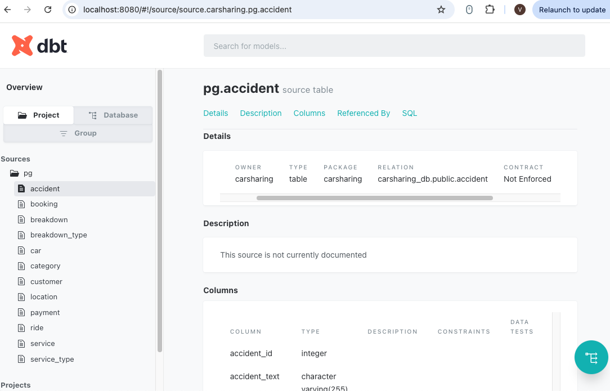

Качественная и понятная документация является одним из основных элементов успешного проекта. Хорошо задокументированное решение позволяет быстро находить ответы на многие вопросы не только техническим специалистам, но и бизнес-пользователям.

В разделе «[Создание моделей промежуточного слоя](./sozdanie-modeley-promezhutochnogo-sloya-intermed#отслеживание-связей-между-моделями)» вы уже немного познакомились с функциональностью dbt в части документирования. Но там фокус был направлен на отслеживание связей между моделями проекта с помощью DAG (линейного графа).

В текущем разделе вы более подробно разберетесь с процессом документирования и статическим сайтом с документацией dbt-проекта.

## Обзор функциональности

Напомню, что для работы с функциональностью dbt в части документирования используются следующие команды:

-  `dbt docs generate`: сборка (или генерация) документации,

-  `dbt docs serve`: запуск документации в виде локального статического сайта.

Документация по dbt-проекту включает:

-  подробную информацию о проекте (все объекты -- модели, «сиды», тесты, линейный граф зависимости объектов и т.д.);

-  информацию о хранилище (таблицы, столбцы с типами данных и т.д.).

При этом документация представляет собой не просто перечень объектов проекта и платформы. Функциональность dbt позволяет добавлять описания к моделям, столбцам, источникам и многому другому для лучшего понимая создаваемого аналитического решения всеми заинтересованными лицами.

Одним из  важнейших компонентов dbt  является  Directed Acyclic Graph (DAG - направленный ациклический граф или линейный граф). DAG используется для визуального представления объектов проекта и их взаимосвязей, которые определяются с помощью функций `source()` и `ref()`. Это очень эффективный инструмент для понимания происхождения данных (data lineage).

При первой сборке документации (запуск команды `dbt docs generate`)  в структуре проекта происходят некоторые изменения -- в папке `target` создаются два файла - `catalog.json` (содержащий всю информацию о вашем проекте) и `index.html` (стартовая страница сайта с документацией). При последующих запусках обозначенные файлы обновляются.

После сборки (запуск команды `dbt docs serve`) с документацией можно ознакомиться в виде хорошо структурированного локального статического сайта. По сути выполняется запуск `index.html` по адресу <http://localhost:8080>. Остановка сайта выполняется сочетанием клавиш `Ctrl+C`.

Перед знакомством со структурой сайта с документацией выполните небольшую подготовку.

## Подготовка к документированию

Дело в том, что процессы документирования и тестирования (data tests) используют одни и те же файлы.  Поэтому выполните небольшую подготовку перед началом документирования.

Ранее в папке `models/marts/finance/` вы создали файл тестирования для таблицы фактов, который называется `_facts_tests.yml`. Раз уж он будет использоваться не только для тестов, но и формирования документации, то дайте ему более общее (универсальное) название. Переименуйте `_facts_tests.yml` в `_finance__models.yml`.

<image src="./dokumentirovanie.png" title="Рисунок 57. Переименование файла с тестами для финансовой модели " crop="0,0,100,100" objects="square,8.6806,73.7123,30.5556,8.3481,,top-left" width="1550px" height="758px"/>

Такую же процедуру повторите для  измерений. Переименуйте в папке `models/marts/core/` файл `_dimensions_tests.yml` в `_dimensions__models.yml`.

<image src="./dokumentirovanie-5.png" title="Рисунок 58. Переименование файла с тестами для измерений" crop="0,0,100,100" objects="square,6.1372,49.47,26.8626,5.6537,,top-left" width="1840px" height="1048px"/>

## Добавление описания

Основным параметром в процессе документирования dbt-проекта является параметр `description`, который добавляет описание к объектам проекта. При создании тестов вы уж добавляли их описание через этот параметр. Но не только тесты можно документировать.

Вот перечень объектов, к которым dbt позволяет добавить описание  для дальнейшего использования в документации:

-  модели и столбцы моделей;

-  источники, таблиц источников и столбцы источников;

-  «сиды» и столбцы «сидов»;

-  «снэпшоты» и столбцы «снэпшотов»;

-  файлы для решения каких-то нерегулярных задач из папки `analyses`  и их столбцы;

-  макросы и параметры макросов;

-  тесты данных (data tests) и перечисленные в них столбцы;

-  модульные тесты (unit tests).

Перейдите в созданный файл `_finance__models.yml`и добавьте описание для всех столбцов модели `fct_payments.sql`:

```yaml
version: 2

models:
  - name: fct_payments
    description: Оплата за пользование автомобилем 

    columns:
      - name: payment_id
        description: Идентификатор оплаты
        tests:
          - unique
          - not_null    
      - name: amount
        description: Сумма оплаты
        tests:
          - check_positive_values
      - name: created_at 
        description: Дата произведения оплаты
      - name: customer_id
        description: Идентификатор заказчика (арендатора)
      - name: car_id 
        description: Идентификатор автомобиля
```

{width=1620px height=1012px}

Теперь очередь  таблиц измерений. Добавьте в `_dimensions__models.yml` описание для всех столбцов модели `dim_cars.sql`:

```yaml
version: 2

models:
  - name: dim_customers
    columns:
      - name: customer_id
        tests:
          - unique
          - not_null
  - name: dim_cars
    description: Справочник автомобилей
    columns:
      - name: car_id
        description: Идентификатор автомобиля
        tests:
          - unique
          - not_null
      - name: category_text
        description: Категория автомобиля
        tests:
          - accepted_values:
              values: ['business', 'cargo', 'comfort', 'electro', 'standart']
      - name: brand 
        description: Марка автомобиля
      - name: model 
        description: Модель автомобиля
      - name: rate
        description: Тариф аренды автомобиля 
      - name: car_year
        description: Год выпуска
      - name: vin 
        description: VIN номер
      - name: licence_plate 
        description: Государственный регистрационный номер
      - name: mileage
        description: Пробег (км)
  - name: dim_calendar
    columns:
      - name: date_id
        tests:
          - unique
          - not_null
```

<image src="./dokumentirovanie-4.png" title="Рисунок 60. Добавление описания столбцов модели dim_cars" crop="0,0,100,100" objects="square,39.7167,47.1731,58.3954,51.5901,,top-left" width="1892px" height="1052px"/>

## Оптимизация документирования

Вы можете заметить, что уже на таком простом примере документирования двух моделей встречаются одинаковые столбцы с одним и тем же описанием (`name: car_id` и `description: Идентификатор автомобиля`). В боевом продуктивном проекте таких случаев будет гораздо больше.

В dbt для оптимизации подобных ситуация предусмотрена возможность добавления блоков документирования (docs blocks), использующих функциональность Jinja, а также язык разметки Markdown.

Структура блоков документирования очень похожа на файлы макросов и [пользовательских универсальных тестов (custom generic tests)](./testirovanie-modeley#пользовательские-универсальные-тесты-(custom-generic-tests)), но есть два отличия -- ключевое слово (`docs`) и расширение файла (`.md`).

Создайте в папке витрин отдельную папку для документирования `models/marts/_docs/` c файлом `documentation__marts.md` со следующим содержимым:

<note type="lab" title="Примечание">

Наименование файла `.md` может быть произвольным, а наличие отдельной папки для этого файла **не** является обязательным и предлагается лишь для структурирования.

</note>

"){width=1494px height=840px}

Как видите, структура файла очень простая. После ключевого слова docs указывается наименование данного блока документирования, которое должно быть уникальным во всём проекте. Далее добавляется нужный текст, к котором у может быть применено форматирование, доступное в Markdown.

Теперь примените созданный блок документирования. Откройте файлы с описаниями таблиц фактов и измерений (`_finance__models.yml` и `_dimensions__models.yml`) и замените описание для столбца `car_id` на блок документирования по аналогии с применением функций `ref()` и `source()`:

<image src="./dokumentirovanie-6.png" title="Рисунок 62. Добавление блока документирования для модели dim_cars" crop="0,0,100,100" objects="square,41.3251,65.371,36.2649,4.947,,top-left" width="1842px" height="970px"/>

<image src="./dokumentirovanie-7.png" title="Рисунок 63. Добавление блока документирования для модели fct_payments" crop="0,0,100,100" objects="square,45.6272,91.5842,39.5282,4.3564,,top-left" width="1828px" height="1008px"/>

Таким незамысловатым образом, вы можете оптимизировать процесс документирования проекта. При этом не нужно создавать отдельные Markdown-файлы для каждого блока документирования. Просто добавьте столько блоков, сколько нужно в одном файле. Единственная оговорка, создавайте отдельные Markdown-файлы для каждого слоя хранилища с целью поддержания порядка в структуре проекта.

## Структура сайта с документацией

Пересоберите документацию для применения внесенных изменений, а затем запустите статический сайт:

```bash
dbt docs generate
dbt docs serve
```

Статический сайт предоставляет два ракурса обзора документации:

-  объекты dbt-проекта (Project),

-  объекты хранилища (Database).

В свою очередь, ракурс **Project** включает в себя объекты источников (Sources), непосредственно  объекты текущего проекта (модели, макросы, тесты и т.д.), а также объекты импортированных «пакетов» (в текущем примере dbt_utils, который ранее использовали для [создания модели календаря](./sozdanie-modeley-promezhutochnogo-sloya-intermed#модели-для-календаря)).

<image src="./dokumentirovanie-8.png" title="Рисунок 64. Ракурс объектов dbt-проекта" crop="0,0,100,100" objects="square,0.2195,27.1802,15.3677,34.4477,,top-left" width="911px" height="688px"/>

Так как в учебном проекте используется только одна система-источник, то и соответствующая папка в разделе **Sources** всего одна (`pg`) и содержит перечень всех исходных таблиц с подробным описанием каждой из них.

{width=1084px height=695px}

Так как в ходе учебного проекта вы дополнительно документировали только две модели, то перейдите в одну из них для более наглядного получения результата. Структура описания для всех моделей одинакова.

Откройте в иерархии проекта `carsharing/models/marts/finance/` модель `fct_payments`:

<image src="./dokumentirovanie-10.png" title="Рисунок 66. Документация модели fct_payments в ракурсе структуры проекта" crop="0,0,100,100" objects="square,5.7341,82.8622,22.1644,5.3004,,top-left" width="2130px" height="1330px"/>

На странице модели представлены следующие разделы:

-  `Details`:  информация о типе материализации, языке создания модели, месте расположении относительно базы данных и т.д.;

-  `Description`: описание модели;

-  `Columns`: перечень столбцов (полей) с описанием, типами данных, наличием универсальных тестов (generic data tests) для столбцов и т.д.;

-  `Referenced By`: связь с другими объектами (моделями, тестами и т.д.), для которых является источников;

-  `Depends On`: зависимость от других объектов (модели, тесты и т.д.), для которых является целью;

-  `Code`: два варианта кода -- «рабочий» с использованием функциональности Jinja, который используется в dbt-проекте, и «финишный» скомпилированный, который запускается в базе.

Второй ракурс документации представлен в разрезе схем базы данных. Но при этом страница модели та же самая и с теми же атрибутами.

<image src="./dokumentirovanie-11.png" title="Рисунок 67. Документация модели fct_payments в ракурсе базы данных" crop="0,0,100,100" objects="square,0.1086,38.8693,27.146,44.8763,,top-left" width="2122px" height="1304px"/>

-  На этом знакомство с функциональностью dbt заканчивается. Осталось сохранить внесенные изменения и продолжить уже более детально разбираться с этим интересным и полезным инструментом. Небольшой [перечень дополнительных ресурсов](./dopolnitelnye-resursy) поможет вам сделать следующий шаг в этом направлении.

## Сохранение проекта в GitHub

Остановите сайт с документацией и загрузите текущее состояние dbt-проекта в GitHub-репозиторий.

Добавьте все файлы проекта:

```bash
git add .
```

Добавьте сообщение для коммита:

```bash
git commit -m "documentation"
```

Отправьте локальный проект в репозиторий GitHub:

```bash
git push
```

Теперь актуальный код проекта хранится в GitHub-репозитории.