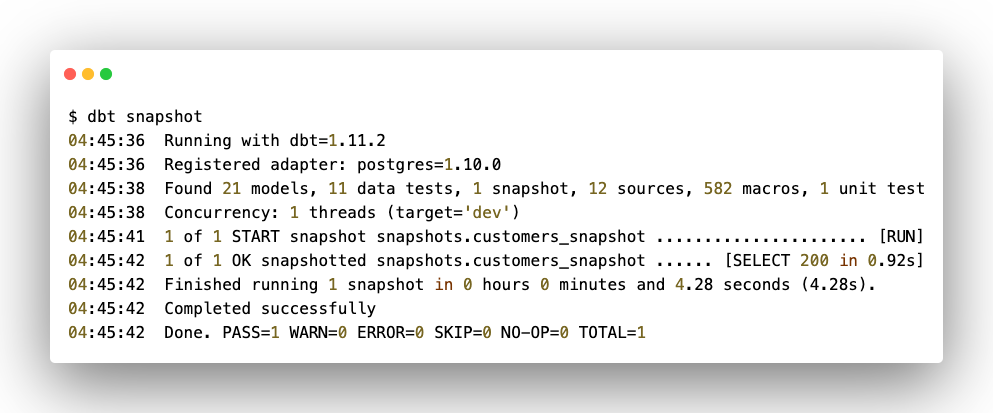

Одна из основных концепций хранилищ данных  - это хранение и обработка  не только актуальных данных за текущий период, но и за предыдущие. Для владельцев и пользователей различных аналитических систем важно понимать как изменялись данные с течением времени. Для этих целей, как уже было отмечено ранее, в dbt™ реализована функциональность [снэпшотов](./razvertyvanie-dbt-proekta#snapshots).

Напомню, что в отличие от моделей, которые всегда содержат только актуальное (текущее или последнее) состояние данных, снэпшоты позволяют вести версионность данных, то есть отслеживать изменение данных  без потери предыдущих состояний.

|                | Стандартные модели                                 | Снэпшоты                                                       |
|----------------|----------------------------------------------------|----------------------------------------------------------------|
| Назначение     | Преобразование данных на основе текущего состояния | Отслеживание изменений данных                                  |
| Материализация | Таблицы или представления с текущими данными       | Таблицы истории, доступные только для добавления (append-only) |

## Механизм формирования снэпшотов

Спэпшоты создаются при выполнении комады `dbt snapshot`. В момент запуска создается первый «слепок» данных, повторяющий структуру исходной таблицы, изменение которой планируется отслеживать, с дополнительными столбцами, включая `dbt_valid_from` и `dbt_valid_to`. При этом у всех записей `dbt_valid_to` будет иметь значение `null`.

При последующих запусках dbt™ проверяет, какие существующие записи изменились и были ли созданы новые. Если какая-то существующая запись изменилась, то `dbt_valid_to` обновит значение, а изменения запишутся в новую строку со значением `dbt_valid_to` = `null`. Новая запись, которой ранее не было тоже будет иметь значение `dbt_valid_to` = `null`.

<note type="lab" title="Примечание">

При настройке снэпшотов в измененных и новых записях существует возможность установить значение `'9999-12-31'` вместо `null` для столбца `dbt_valid_to`.

</note>

Также стоит упомянуть о стратегиях выявления изменений.

Таких стратегий всего две:

-  временная метка (`timestamp`), которая использует столбец `updated_at` для определения изменения записи;

-  проверка (`сheck`), которая сравнивает текущие и предыдущее значения столбцов таблицы, чтобы определить, изменилась ли запись.

## Стратегия временной метки (timestamp)

Стратегия временных меток используется, когда исходные записи содержат поле, которое обновляется при каждом изменении (например, столбец `last_update`). Движок dbt™ использует этот столбец, чтобы определить, изменилась ли запись с момента последнего запуска снэпшота.

Чтобы использовать данную стратегию, необходимо указать столбец в настройках снэпшотов. dbt™ сравнивает предыдущее значение с текущим значением при каждом запуске. Если временная метка изменилась, dbt™ рассматривает запись как обновленную, завершает предыдущую версию и вставляет новую запись.

Эта стратегия эффективна, однако требует наличия надежного и постоянно обновляемого столбца временных меток в исходных данных. Если временная метка не изменяется при изменении данных, то dbt™ не выполнит обновление снэпшота.

## Стратегия проверки (сheck)

Стратегия проверки применяется в случаях, когда в исходной таблице отсутствует столбец с датой/временем обновления. Эта стратегия работает путем сравнения одного или нескольких столбцов между их текущими и предыдущими значениями (например, `check_cols = ["phone", "email"]`). Если значение в записи какого-либо из этих столбцов изменилось, то dbt™ аннулирует старую запись и запишет новую. Если значения столбцов идентичны, dbt™ не будет предпринимать никаких действий.

Данная стратегия может быть более затратной с точки зрения вычислений, особенно для широких таблиц или больших наборов данных. Важно выбирать только те столбцы, которые, как ожидается, могут измениться, чтобы избежать ненужного управления версиями. Поэтому разработчиками dbt™ рекомендовано использование стратегии временных меток, так как при этой стратегии требуется отслеживать только одну колонку (`updated_at`), а также уменьшается вероятность возникновения ошибок (например, если несвоевременно будет обновлена настройка стратегии при изменении схемы таблицы, когда добавляются/удаляются столбцы, участвующие в формировании «слепков»).

<note title="Важно">

В случае использования стратегии проверки может возникнуть соблазн настроить для отслеживания изменений все столбцы исходной таблицы, указав `check_cols = «all»`. Хотя такая настройка является штатной, но разработчики dbt™ все-таки рекомендуют перечислять конкретные столбцы, которые необходимо проверять, или же рассмотреть возможность использования суррогатного ключа по нескольким столбца. Затем этот ключ указывать в настройках формирования снэпшота.

</note>

## Процесс построения снэпшотов

Процесс построения снэпшота в dbt™ содержит следующие этапы:

1. Определение источника.

2. Настройка и построение модели снэпшота.

3. Запуск снэпшота.

### Определение источника

В качестве источника для снэпшотов можно использовать как таблицы исходной системы, так и модели staging-слоя. На примере одной из staging-моделей проекта отследим изменение контактной информации заказчиков (`stg_pg__customers`).

### Настройка и построение модели «снэпшота»

<note type="lab" title="Примечение">

До версии dbt™ 1.9 существовала возможность конфигурации снэпшотов *только* через SQL синтаксис. Но начиная с версии 1.9, можно обойтись настройками с помощью YAML. Хотя вариант с SQL также продолжает функционировать.

Перед началом работы со снэпшотами рекомендуется обновить версию (минимум до 1.9)

</note>

Создайте в папке `snapshots` файл `customers_snapshot.yml` и добавьте в него следующий код:

```yaml
snapshots:
  - name: customers_snapshot
    relation: ref('stg_pg__customers')
    config:
      schema: snapshots
      unique_key: customer_id
      strategy: timestamp
      updated_at: updated_at
      dbt_valid_to_current: "cast('9999-12-31' as date)"
```

<image src="./istoricheskie-dannye-2.png" title="Рисунок 68. Конфигурация снэпшота" crop="0,0,100,100" objects="square,5.2157,48.4099,33.3004,16.7845,,top-left" width="1574px" height="894px" float="center"/>

### Запуск снэпшота

Снэпшоты не совсем обычные модели. Как было отмечено ранее, в проекте они хранятся не в общей папке `models`, а в отдельной `snapshots`. Более того, для них создается отдельная схема, что является своего рода «защитой от дурака» -- потенциального удаления этих таблиц. Поэтому снэпшоты создаются отдельной командой `dbt snapshot` (или же в рамках общей сборки проекта `dbt build`).

Выполните команду создания снэпшотов:

```bash
dbt snapshot
```

<note type="lab" title="Примечание">

Команда `dbt snapshot` запускает сразу все имеющиеся снэпшоты. Если требуется запустить какую-то определенную модель, то используйте команду `dbt snapshot --select snapshot_name`, где snapshot_name -- название модели снэпшота.

Например, запуск рассмотренного ранее снэпшота можно было выполнить так:

`dbt snapshot --select customers_snapshot`

</note>

После запуска команды вы сразу увидите лог с информацией об успешности запуска и формировании снэпшотов, или же возникшей ошибке:

{width=993px height=413px}

Проверьте полученный результат в базе. Согласно выполненным настройками создалась новая схема `snapshots` с таблицей `customers_snapshot`:

<image src="./istoricheskie-dannye-3.png" title="Рисунок 70" crop="0,0,100,100" objects="square,6.1873,45.788,22.0736,4.3478,,top-left&square,6.1873,91.5761,21.7391,7.0652,,top-left" width="1196px" height="736px" float="center"/>

## Пример отслеживания изменений

Для примера возьмите несколько произвольных записей  и сымитируйте их изменение в системе-источнике (таблица `public.customer`).

```postgresql
select * from public.customer
where customer_id in (1,2)
```

<image src="./istoricheskie-dannye-4.png" title="Рисунок 71" crop="0,0,100,100" objects="square,0.8634,9.4463,13.5793,4.5603,,top-left&square,1.0989,90.8795,13.1083,5.5375,,top-left&square,15.5416,25.2443,25.1962,12.3779,,top-left" width="1274px" height="614px" float="center"/>

Предположим, что первый пользователь (Агата Морозова) сменил фамилию и, соответственно, водительское удостоверение, а второй (Александр Баранов) -- номер телефона и адрес электронной почты. При внесении изменений в исходной системе также обновится значение временной метки.

Выполните следующий запрос для обновления данных в исходной таблице: