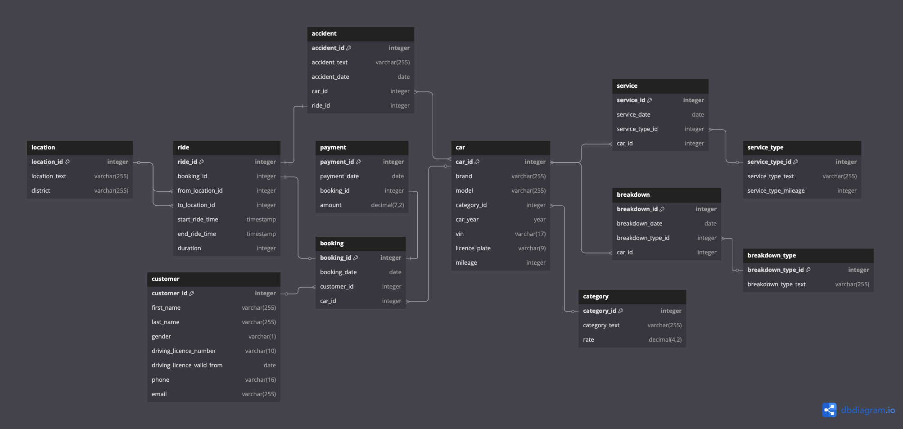
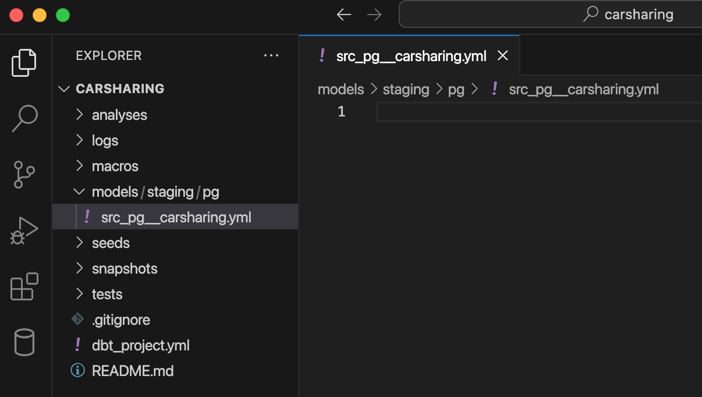

Любой проект по созданию хранилища данных можно свести к двум основным задачам:

1. Поиск подходящих источников данных.

2. Преобразование данных для получения определенных результатов (удоволетворяющих бизнес).

Для реализации учебного проекта искать источники не потребуется. Как ранее было отмечено, предполагается, что транзакционные данные каршеринга уже загружены в хранилище (база PostgreSQL).

Но небольшую подготовку провести все-таки надо.

### **Загрузка данных в PostgreSQL**

Скачайте по ссылке архив для базы данных проекта.

Откройте pgAdmin и загрузите скачанный файл в PostgreSQL.

В результате выполненных действий у вас появится база данных `carsharing_dbt`, которая состоит из 12 таблиц в схеме `public`.

Физическая схема транзакционных данных выглядит следующим образом:

{width=2006px height=953px}

<note type="lab" title="Примечание">

Интерактивный вариант диаграммы можно посмотреть с помощью сервиса [dbdiagram.io](http://dbdiagram.io).

</note>

### **Объявление источников данных**

Источники в dbt-проекте объявляются с помощью YAML-файла, который расположен в корне папки `staging`. При этом название для этого настроечного файла можно выбрать абсолютно любое.

<note type="lab" title="Примечание">

В продуктивном проекте может быть (и это вполне логично) несколько источников данных. Все эти источники можно указать как в одном файле на уровне папки `staging`, так и в виде отдельных файлов для каждой системы-источника, для которых создаются подпапки в `staging`. Второй вариант считается лучшей практикой.

</note>

Несмотря на то, что в текущем учебном проекте всего одна система-источник, создайте в `models` папку `staging` и вложенную в нее папку `pg`, в которой, в свою очередь, создайте новый файл `src_pg__carsharing.yml`.

{width=1206px height=682px}

Добавьте следующие настройки в  `src_pg__carsharing.yml` для источников:

1. `name` – произвольное имя источника (например, pg)

2. `database` – имя базы, которое указано в настройке профилей `profiles.yml`

3. `schema` – имя схемы, которое указано в настройке профилей `profiles.yml`

4. `tables/name` – перечислите все таблицы, данные из которых импортируются в проект.

```bash
version: 2

sources:
  - name: pg
    database: carsharing_db
    schema: public
    tables:
      - name: customer
      - name: booking
      - name: payment
      - name: ride
      - name: location
      - name: car
      - name: category
      - name: service
      - name: service_type
      - name: breakdown
      - name: breakdown_type
      - name: accident
```

Источники определены, пришло время создать первые модели проекта. Но прежде сохраните текущее состояние проекта в центральном репозитории Github.

### **Сохранение проекта в git-репозитории**

Загрузите текущее состояние dbt-проекта в репозиторий, который вы создали ранее (в главе «Развертывание проекта»). Для этого откройте в VS Code панель с терминалом или же запустите командную строку отдельно (предварительно переместитесь в папку dbt-проекта). Но прежде, инициализируйте git-репозиторий в папке проекта.