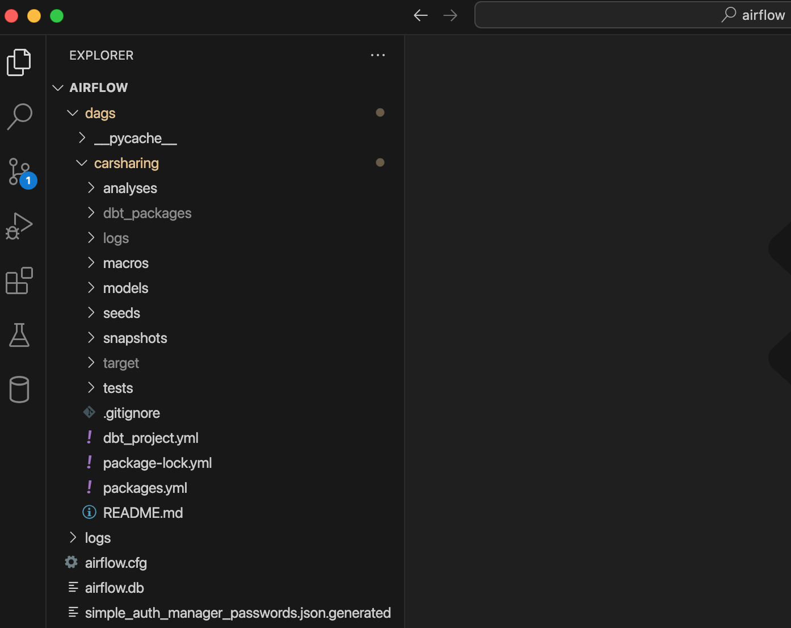
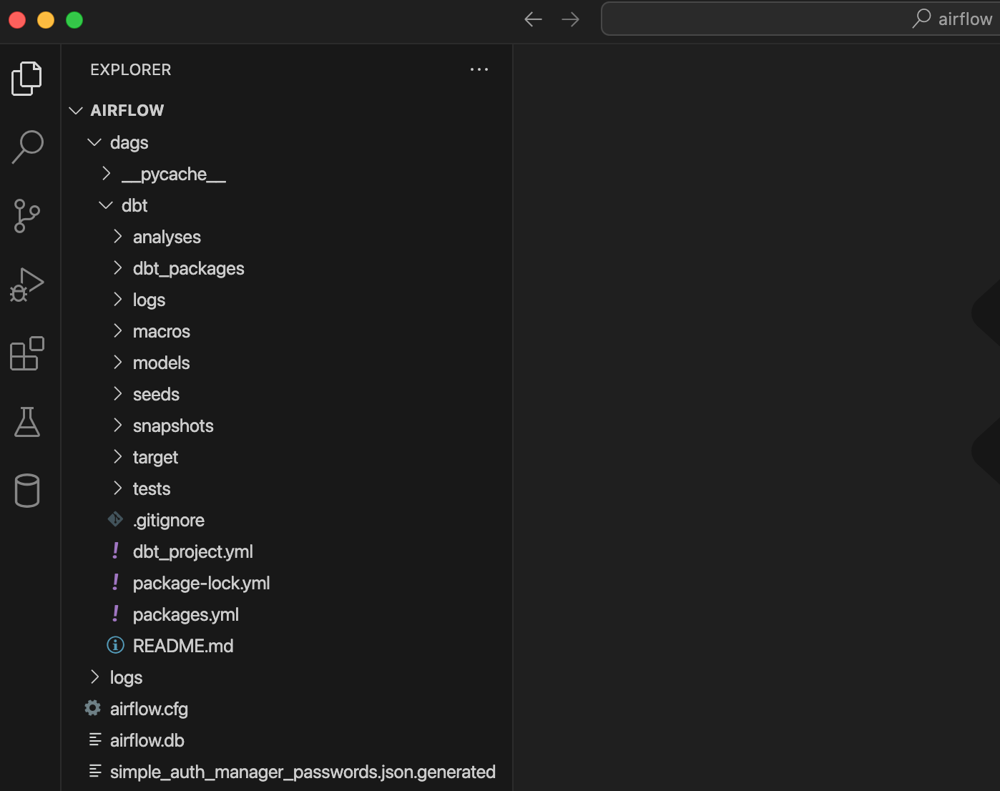

Под оркестрацией понимается управление запусками по расписанию, отслеживанием зависимостей и мониторинг выполнения задач.

Так как dbt Core - это только инструмент трансформации данных и у него отсутствует функциональность автоматического запуска по расписанию, то для таких целей необходимо использовать дополнительные внешние системы или инструменты.

<note type="lab" title="Примечание">

В отличие от open-source версии (dbt Core) возможность запуска по расписанию есть в платной версии (dbt Cloud).

</note>

## Основные варианты оркестрации

Можно выделить следующие основные варианты оркестрации задач dbt Core:

-  использование классического планировщика задач cron,

-  применение «современных» инструментов-оркестраторов.

### Классический планировщик cron

### «Современные» инструменты-оркестраторы

В настоящее время существует несколько инструментов, которые можно использовать для оркестрации задач dbt™. Среди них можно выделить, например, Apache Airflow, Dagster, Prefect и другие.

Каждый из этих инструментов обладает определенными преимуществами, которые можно использоваться, исходя из целей и потребностей текущего проекта. Тем не менее в индустрии сложился некий негласный «стандарт» для оркестрации задач dbt Core через взаимодействие с Apache Airflow. Поэтому на интеграции именно с этим инструментом мы остановимся.

## Оркестрация с помощью Airflow

**Steps to Install Cosmos without Docker**

1. **Set up Virtual Environment:** Create and activate a virtual environment (`python -m venv venv`, then `source venv/bin/activate` or `venv\Scripts\activate` on Windows).

2. **Install Airflow:** Install Apache Airflow using pip: `pip install apache-airflow`.

3. **Install Cosmos:** Install the astronomer-cosmos package: `pip install astronomer-cosmos`.

4. **Install dbt:** Install your specific dbt adapter (e.g., `pip install dbt-snowflake` or `dbt-bigquery`).

5. **Configure dbt Project:** Move your dbt project into the Airflow DAGs directory.

6. **Create DAG:** Create a `my_cosmos_`[`dag.py`](http://dag.py) file to define your DAG using the `DbtDag` object.

{width=1394px height=1106px}

{width=1398px height=1106px}