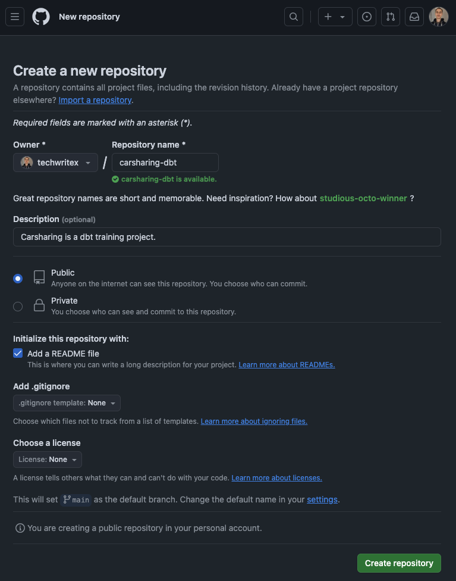
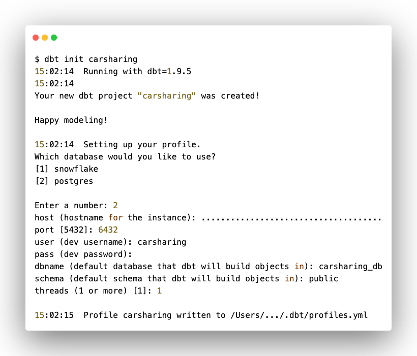
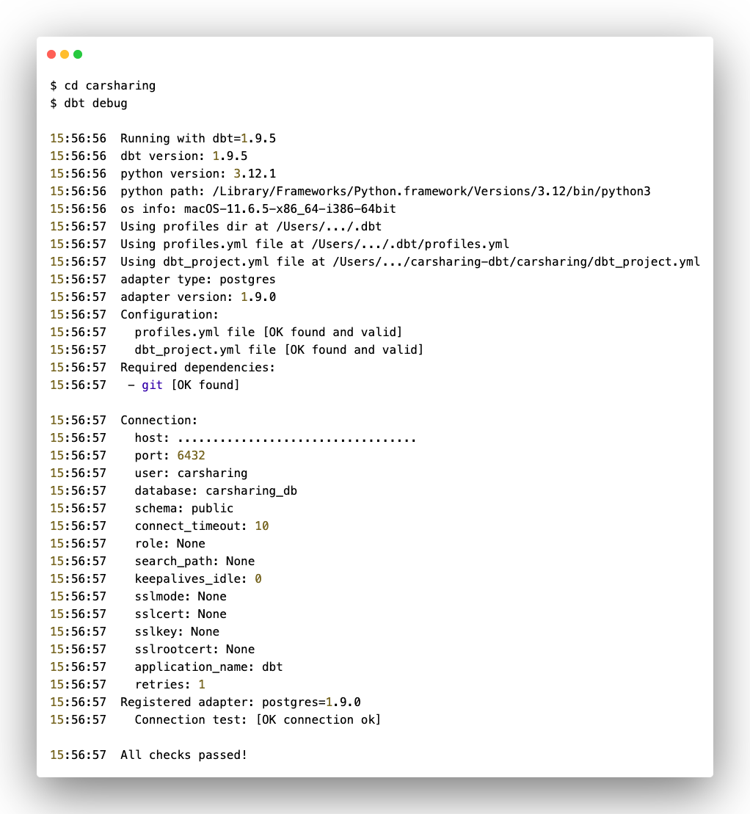
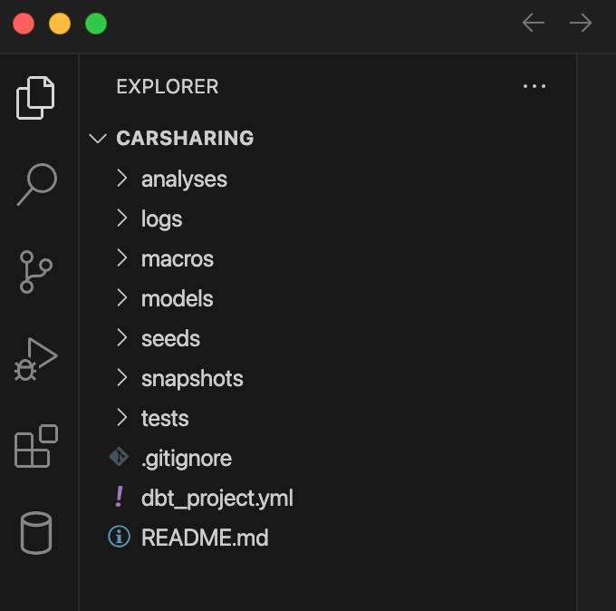
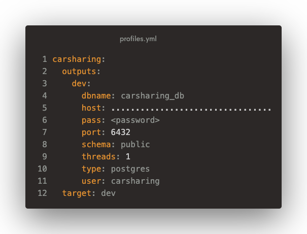
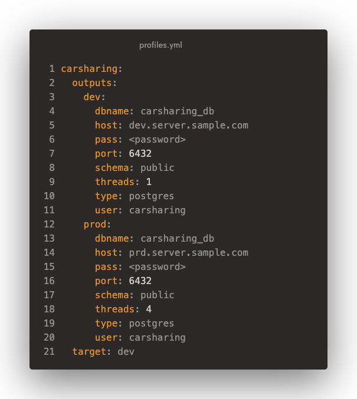
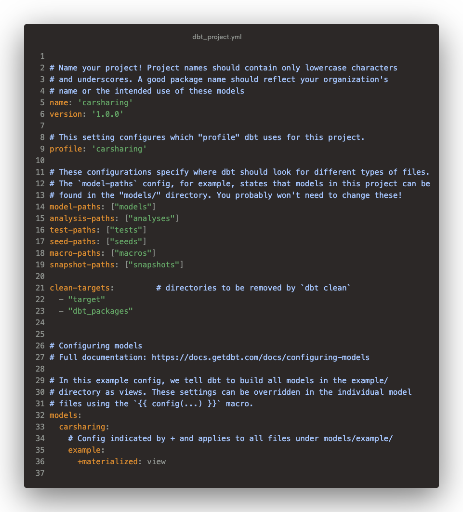
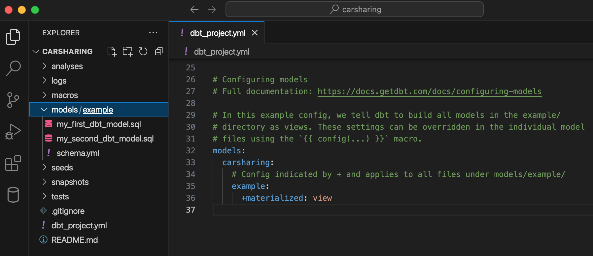

## **Создание репозитория**

Развертывание проекта начнем с применения практик разработки программного обеспечения.

Перейдите в [GitHub](https://github.com/new) (учетную запись вы создавали ранее на шаге подготовки оснастки) и создайте новый репозиторий, который будет содержать все файлы проекта и историю их изменений.

Укажите **Repository name** (имя репозитория) и **Description** (описание).

Выберите настройку видимости в зависимости от ваших предпочтений (Public/Private).

Нажмите **Create repository** (создать репозиторий).

{width=767px height=976px}

Оставьте на некоторе время Github и займитесь инициализацией dbt-проекта. **Создание проекта**

Для создания dbt-проекта вернитесь в командную строку на вашем компьютере и перейдите в папку, в которой вы планируете разместить проект (в моем случае, `carsharing-dwh-project-space`).

Выполните команду инициализации dbt-проекта:

```bash
$ dbt init carsharing
```

После выполнения команды будет создан проект с заданным именем (папка с именем проекта `carsharing`).

Далее переходите к настройке профиля, который содержит параметры подключения к платформе данных.

Первым делом расскажите dbt о том, к какой платформе данных вы собираетесь подключаться. Если ранее вы устанавливали только один адаптер, то в перечне платформ будет только одно значение. В моем примере две платформы, так как ранее тестировал несколько вариантов. Соотвественно, выберите номер платформы из списка.

Далее укажите параметры соединения:

-  хост,

-  порт,

-  имя БД,

-  схема,

-  логин и пароль пользователя,

-  количество потоков (threads).

Хотя мы еще не погружались в детали dbt, но здесь стоит немного задержаться, чтобы понять суть параметра `threads`.

Когда с помощью определенной команды (рассмотрим ее немного позднее) запускается проект, то создается направленный ациклический граф (DAG, инструмент моделирования или структурирования данных), построенный на связях между основными сущностями dbt - моделями, которые являются SQL-запросами.

Параметр `threads` устанавливает максимальное количество SQL-запросов (моделей), которые будут выполняться на стороне платформы данных в один момент времени.

Например, если указать `threads: 1`, то dbt создаст только одну модель и не перейдет к работе над следующей моделью, прежде чем не завершит работу над текущей. Указание `threads: 5` означает, что dbt будет работать над пятью моделями одновременно.

<note type="lab">

##### **Примечание**

Пока мне нигде не встречалось упоминание об ограничении количества потоков. По всей видимости, данное ограничение связано лишь с возможностями и вычислительными ресурсами платформы данных. Чем больше количество потоков, тем быстрее скорость создания моделей, но и нагрузка на платформу также возрастает. Поэтому для продуктивных решений необходимо проводить нагрузочное тестирование.

</note>

Для нашего небольшого учебного проекта можно указать один поток или воспользоваться рекомендациями разработчиков (dbt Labs) начинать с четырех потоков (`threads: 4`).

Вернемся к параметрам соединения. Они сохраняются в конфигурационном файле `profiles.yml`, который хранится за пределами dbt-проекта (путь указывается в сообщении после параметров соединения), чтобы избежать проверки конфиденциальных учетных данных в системе контроля версий. Более подробно рассмотрим данный файл в следующем разделе.

{width=820px height=701px}

С помощью командной строки перейдите в созданную папку проекта и запустите команду проверки соединения:

```bash
$ cd carsharing
$ dbt debug
```

{width=1022px height=1109px}

## **Обзор проекта**

### **Структура**

Запустите среду ведения разработки (в моем случае VS Code) и откройте папку dbt-проекта:

{width=680px height=674px}

Проект представляет собой набор SQL, YAML и Markdown файлов, организованных в папки. Каждый из этих типов файлов выполняет определенную задачу.

*Таблица 2. Типы файлов dbt-проекта*

| **Тип файла** | **Назначение**           |
|---------------|--------------------------|
| SQL           | Построение моделей       |
| YAML          | Настройка (конфигурация) |
| Markdown      | Документирование проекта |

<note type="lab" title="Примечание">

Также для построения моделей могут применяться py-файлы.

</note>

При инициализации dbt-проекта практически все папки пустые. Вкратце опишу каждую из них. Но для начала пройдемся по двум основным настроечным файлам - `profiles.yml` и `dbt_project.yml`.

### **profiles.yml**

Как было отмечено ранее, данный файл содержит параметры соедиения с платформой данных и хранится за пределами проекта по соображениям безопасности, поэтому он отсутствует в обозначенной структуре.

<note type="lab" title="Примечание">

Конфигурационный файл `profiles.yml` требуется только для dbt Core, для dbt Cloud данная настройка не требуется, так как облачная версия подключается к платформам данных напрямую через веб-интерфейс.

</note>

Чтобы открыть файл, запустите команду:

```bash
open ~/.dbt/profiles.yml
```

Применительно к учебному проекту конфигурационный файл `profiles.yml` имеет следующий вид:

{width=605px height=461px}

Рассмотрим структуру файла `profiles.yml`.

В первой строке указано имя профиля (carsharing). Этих имен может быть несколько, так как с помощью dbt можно подключаться к нескольким платформам данных.

Со второй строки начинается разграничение ландшафта. Другими словами, здесь можно разделить продуктивное хранилище (prod) и разработку (dev). В учебном проекте достаточно одного уровня. Но для продуктивного решения достаточно добавить новые параметры соединения.

Например, может быть такой вариант:

{width=605px height=677px}

В последней строке указывается целевой уровень ландшафта (сервер), который dbt будет использовать в проекте по умолчанию. Как правило, в качестве цели указывается dev.

### **dbt_project.yml**

В каждом dbt-проекте создается конфигурационный файл `dbt_project.yml`, в котором содержатся настройки для функционирования всего проекта.

После инициализации проекта файл имеет следующее состояние:

{width=961px height=1061px}

Первые два параметра (`name` и `version`) содержат название и версию проекта. С этим вроде бы никаких сложностей.

Гораздо интереснее следующий настроечный параметр - `profile`. Он используется для соединения с платформой данных. Механизм следующий: в момент запуска проекта (выполнение команды `dbt run`, о ней поговорим дальше) dbt считывает значение `profile` в `dbt_project.yml`, затем в `profiles.yml` по найденному имени профиля получает всю информацию, необходимую для подключения к платформе данных.

Следующий «блок» настроек связан с организацией различных типов файлов проекта. Другими словами, здесь представлены названия папок, где будут храниться определенные файлы. Сейчас не будем углубляться в детали. Сделаем это в последующих разделах.

Далее идут настройки материализации для моделей проекта. Здесь подробности опять же пока опустим.

Теперь пройдемся по папкам проекта.

### **analyses**

Папка `analyses` содержит SQL-файлы, которые применяются для решения каких-то конкретных нерегулярных задач.

Например, требуется выполнить специальный (ad-hoc) запрос для подготовки какого-то, скажем, разового отчета или что-то быстро протестировать (возможно, в части логики), но при этом нет необходимости в материализации результата запроса и периодичности его выполнения. Просто нужно один раз скомпилировать запрос функциональными возможностями dbt, скопировать полученный результат и затем использовать его, где это требуется.

### **logs**

В папке `logs` хранится один единственный файл `dbt.log`, в который записываются все события, возникающие в процессе работы над dbt-проектом.

### **macros**

Папка `macros` используется для хранения SQL-файлов с фрагментами кода - макросами.

Макрос в dbt -- это повторно используемый фрагмент кода, который можно вызывать в различных местах dbt-проекта. Макросы упрощают работу по преобразованию данных, снижают трудозатраты на разработку и сокращают количество ошибок.

Макросы в dbt создаются с помощью шаблонизатора (или языка создания шаблонов) [Jinja](https://jinja.palletsprojects.com/en/stable/templates/), который позволяет создавать динамические SQL-запросы со сложной логикой, включать в них переменные, а также использовать структуры управления, такие как условные операторы (`if/else`) и циклы (`for`).

Подробнее с макросами познакомимся в ходе работы над проектом.

### **models**

<https://docs.getdbt.com/docs/build/models>

Папка models используется для хранения и организации основных сущностей dbt-проекта – моделей, может содержать другие подпапки (в соответствии с архитектурным решением вашей платформы данных – подпапки для источников, витрин и т.д.).

Примечание: все модели в dbt создаются с использованием обобщенных табличных выражений или common table expressions (CTE).

### **seeds**

Папка `seeds` используется для хранения небольших CSV-файлов со статическими редко изменяемыми данными (например, какие-то справочники), которые можно загрузить с помощью dbt напрямую в хранилище. На “сиды” можно ссылаться так же, как на модели проекта и использовать в процессах трансформации данных.

Данная папка ни в коем случае не является альтернативой процессам загрузки данных в хранилище.

### **snapshots**

Папка `snapshots` содержит “слепки” (“снэпшоты” или “снимки”, кому как привычнее) таблиц для формирования исторических данных.

В dbt слепки реализуются согласно механизму медленно изменяющихся измерений (Slowly Changing Dimensions, SCD) второго типа (SCD2). При этом подходе сохраняется полная история изменений данных по измерению с добавлением новых строк в таблице при каждом изменении. При этом старые записи сохраняются.

Рассмотрим вкратце принцип работы формирования слепков.

Спэпшоты создаются при выполнении комады `dbt snapshot`. В момент запуска создается первый слепок, повторяющий структуру исходной таблицы, изменение которой планируется отслеживать, с дополнительными столбцами, включая `dbt_valid_from` и `dbt_valid_to`. При этом у всех записей `dbt_valid_to` будет иметь значение `null`.

При последующих запусках dbt проверяет, какие существующие записи изменились и были ли созданы новые. Если какая-то существующая запись изменилась, то `dbt_valid_to` обновит значение, а изменения запишутся в новую строку со значением `dbt_valid_to` = `null`. Новая запись, которой ранее не было тоже будет иметь значение `dbt_valid_to` = `null`.

Также стоит упомянуть о стратегиях выявления изменений.

Таких стратегий всего две:

-  временная метка (timestamp), которая использует столбец `updated_at` для определения, изменилась ли запись;

-  проверка (сheck), которая сравнивает текущие и исторические значения столбцов таблицы, чтобы определить, изменилась ли запись.

<https://docs.getdbt.com/docs/build/snapshots#snapshot-meta-fields>

### **tests**

<https://docs.getdbt.com/reference/project-configs/test-paths> <https://docs.getdbt.com/docs/build/data-tests>

Папка tests используется для хранения SQL-файлов (SELECT-запросов) для тестирования моделей, источников данных, «сидов» (CSV-файлов со статическими данными), слепков данных.

## **Подготовка проекта**

При развертывании dbt-проекта создаются первичные настройки в файле `dbt_project.yml` (как уже рассмотрели ранее), а также две тестовые модели (`my_first_dbt_model.sql`, `my_second_dbt_model.sql`) и конфигурационный файл для этих моделей (`schema.yml`) в папке `models/example`.

{width=1796px height=778px}

Откройте SQL-файлы моделей из примера и посмотрите на них, чтобы получить общее представление.

Посмотрели? Теперь просто удалите их вместе с папкой `examples`.

Поздравляю с первой победой. Вот теперь всё готово для работы над проектом.