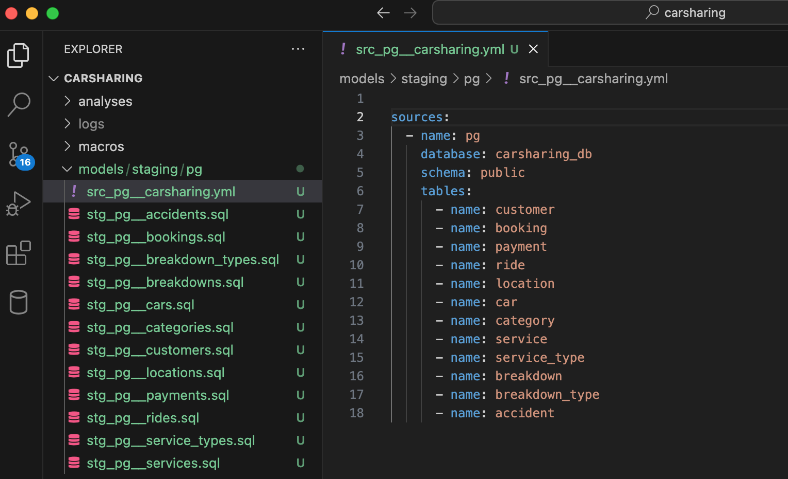
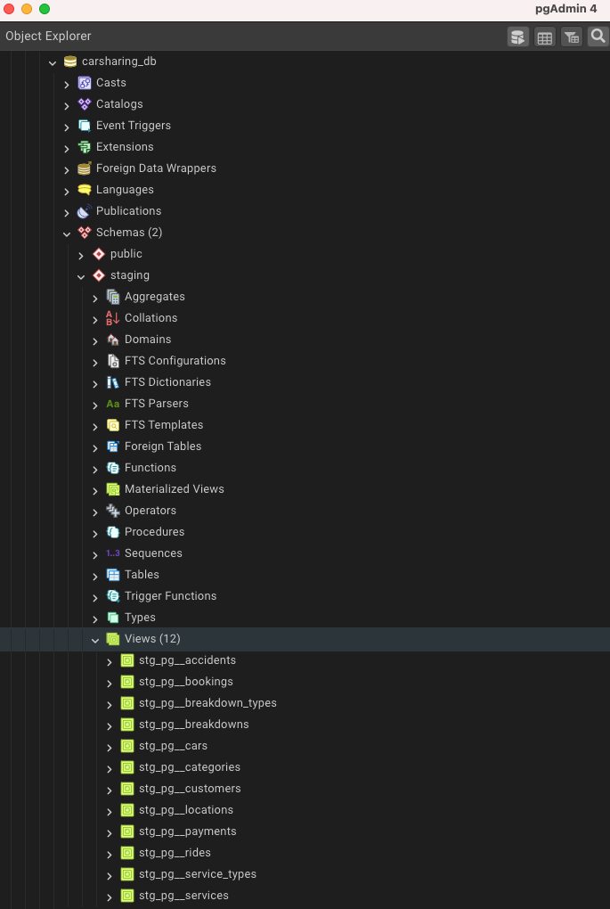

Теперь, когда определены источники, можете наконец-то начать использовать функциональность dbt для преобразования данных.

Первым шагом в процессе преобразования будет создание моделей staging-слоя.

## Модели слоя

Как ранее было обозначено, одно из основных преимуществ dbt автоматизация повторного использования фрагментов кода с помощью шаблонизатора Jinja.

<note type="lab" title="Примечание">

Одна из наиболее важных функций dbt (реализованных с помощью Jinja) – `ref()`, которая позволяет связывать модели между собой. Есть еще одна функция, которая тоже выполняет подобную задачу, но используется для привязки источников данных к моделям – `source()`.

</note>

Staging-модели, как и модели других слоев хранилища, создаются с помощью обобщенных табличных выражений или common table expressions (CTE). В общем виде модель первичного слоя выглядит следующим образом:

```sql
with source as (
    
    select * from {{ source('имя источника','таблица источника') }}

),

staged as (

    select
    
        (перечень полей таблицы источника)
    
    from source

)

select * from staged
```

Создайте вашу первую модель для хранения данных о заказчиках.

В папке  `models/staging/pg` создайте файл `stg_pg__customers.sql`, добавьте следующий код и сохраните модель:

```PostgreSQL
with source as (
    
    select * from {{ source('pg','customer') }}

),

staged as (

    select
    
        customer_id,
        first_name,
        last_name,
        gender,
        driving_licence_number,
        driving_licence_valid_from,
        phone,
        email,
        last_update as updated_at   
    
    from source

)

select * from staged
```

Создайте по аналогии модели по всем таблицам системы-источника, указанным в настроечном файле `src_pg__carsharing.yml`.

{width=1528px height=932px}

## Запуск проекта и обновление хранилища

В предыдущем разделе вы создали первые модели вашего dbt-проекта. Но пока это всего лишь набор файлов, организованных в папки. Если сейчас вы проверите базу данных PostgreSQL, то никаких изменений там не встретите.

Для того, чтобы изменения появились, необходимо запустить dbt-проект.

Вернитесь в VS Code и перейдите в панель с терминалом (или же запустите командную строку, предварительно переместившись в папку dbt-проекта, если вы оттуда вышли).

Выполните команду запуска проекта:

```bash
dbt run
```

После запуска команды вы сразу увидите лог со следующей информацией:

-  Версия dbt

-  Используемый адаптер к системе-источнику

-  Предупреждение (warning) о том, что в настройках проекта есть два слоя хранилища, которые не содержат никаких моделей

-  Количество найденных объектов

-  Статусы создания моделей

-  Статус запуска (создания) проекта

"){width=1234px height=941px}

Проверьте полученный результат в базе. В соответствие с настройками создана новая схема `staging` и 12 представлений (view):

{width=685px height=1020px}

Обратите внимание, что после выполнения команды `dbt run` в структуре проекта создается папка `target` с двумя подпапками – `compiled` и `run`, а также некоторыми другим файлами.


