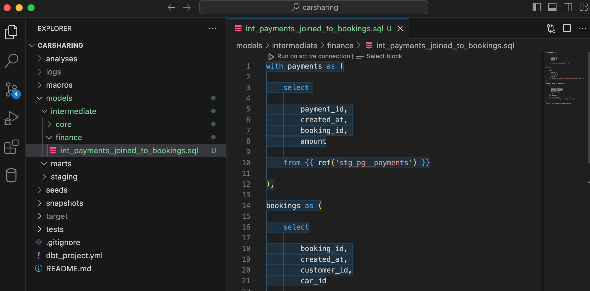
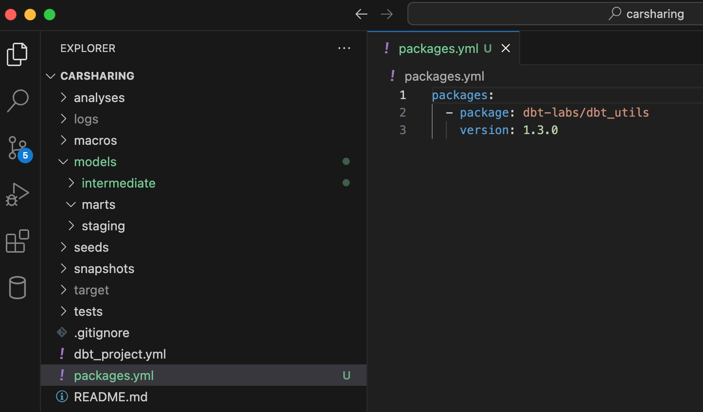

Перед тем, как перейти к созданию моделей вспомните подход к структурированию объектов промежуточного слоя и задачу учебного проекта.

Структура подпапок промежуточного слоя ориентирована на бизнес-структуру. Другими словами, если потребителями данных являются несколько подразделений компании, то в папке `intermediate` рекомендуется создать отдельные вложенные папки для хранения моделей для каждого из этих подразделений. В том случае, если имеются «общие» модели, которые используются всеми (или несколькими) подразделениями, то создайте для них отдельную вложенную в intermediate папку.

## Структура слоя

Исходя из задачи учебного проекта, создайте вложенные папки в  `intermediate`:

-  `core` – для хранения «общих» моделей,

-  `finance` – для хранения моделей финансового отдела,

-  `service` – для хранения моделей сервисного отдела.

## Модели слоя

### Общие модели

Одна из основных сущностей, которая может быть использована обоими отделами компании – заказчики (customers). Сама данная сущность будет создана на слое витрин, а промежуточный слой – место для преобразования данных для этой сущности.

На staging-слое есть модель `stg_pg__customers.sql`, которая содержит отдельные поля с именами и фамилиями заказчиков – `first_name` и `last_name`. Но по отдельности такие поля в аналитике практически не используются. В связи с этим, выполните первое простое преобразование данных на промежуточном слое – объединение этих двух полей.

Напомню, что dbt-модели создаются с помощью обобщенных табличных выражений (CTE). В общем виде модель промежуточного слоя выглядит следующим образом:

```sql
with имя-cte as (

    select

        (перечень полей staging-модели)

    from {{ ref('имя-staging-модели') }}

)

select * from имя-cte
```

Создайте в папке `models/intermediate/core/` файл (в соответствие с правилами наименования) `int_customers_name_concatenated.sql` и добавьте код:

```sql
with customers as (

    select

        customer_id, 
        concat(first_name,' ',last_name) as full_name, 
        gender, 
        driving_licence_number, 
        driving_licence_valid_from, 
        phone, 
        email, 
        updated_at

    from {{ ref('stg_pg__customers') }}

)

select * from customers
```

{width=1726px height=1018px}

Пусть это достаточно простой пример, но на нем вы увидели не менее простой принцип создания модели промежуточного слоя dbt-проекта.

Вторая общая сущность в платформе данных каршеринговой компании – автомобили (cars). В исходных данных к этой сущности можно отнести две таблицы – `car` (информация об автомобилях компании) и `category` (категория автомобилей – стандарт, комфорт, бизнес и т.д.).

Для создания обобщенной модели с данными об автомобилях обогатите данные таблицы `car` данными таблицы `category`.

Создайте в папке `models/intermediate/core/` файл (в соответствии с правилами наименования) `int_cars_joined_to_categories.sql`.

Сделайте выборку данных из каждой staging-модели, а затем соедините:

```sql
with cars as (

    select 

        car_id, 
        brand, 
        model, 
        category_id, 
        car_year, 
        vin, 
        licence_plate, 
        mileage

    from {{ ref('stg_pg__cars') }}

),

categories as (

    select

        category_id, 
        category_text, 
        rate

    from {{ ref('stg_pg__categories') }}

), 

cars_joined_to_categories as (

    select

        cars.car_id, 
        cars.brand, 
        cars.model, 
        categories.category_text, 
        categories.rate,
        cars.car_year, 
        cars.vin, 
        cars.licence_plate, 
        cars.mileage

    from cars

    left join categories
    on cars.category_id = categories.category_id

)

select * from cars_joined_to_categories
```

{width=1704px height=1070px}

На промежуточном слое в качестве источников могут использоваться не только staging-модели, но и модели непосредственно промежуточного слоя. Примените эту идею в создании третьей общей сущности в платформе данных – бронирования (bookings). Как правило, бронирование содержит информацию о субъекте и объекте брони и будем считать эту сущность эквивалентом заказа. Применительно к учебному проекту модель бронирования должна быть представлена в разрезе заказчика и автомобиля.

Для создания этой модели используйте staging-модель с бронированиями, а также созданные на предыдущих шагах модели промежуточного слоя.

Создайте в папке `models/intermediate/core/` файл  `int_bookings_joined_to_customers_and_cars.sql` и добавьте следующий код:

```sql
with bookings as (

    select 

        booking_id,
        created_at,
        customer_id,
        car_id

    from {{ ref('stg_pg__bookings') }}

),

customers as (

    select

        customer_id, 
        full_name, 
        gender, 
        driving_licence_number, 
        driving_licence_valid_from, 
        phone, 
        email, 
        updated_at

    from {{ ref('int_customers_name_concatenated') }}

),

cars as (

    select 

        car_id, 
        brand, 
        model, 
        category_text, 
        rate,
        car_year, 
        vin, 
        licence_plate, 
        mileage

    from {{ ref('int_cars_joined_to_categories') }}

),

bookings_joined_to_customers_and_cars as (

    select

        bookings.booking_id,
        bookings.created_at,
        customers.customer_id, 
        customers.full_name, 
        customers.gender,
        cars.car_id,
        cars.brand, 
        cars.model, 
        cars.category_text, 
        cars.rate

    from bookings

    left join customers
    on bookings.customer_id = customers.customer_id

    left join cars
    on bookings.car_id = cars.car_id

)

select * from bookings_joined_to_customers_and_cars
```

{width=1892px height=1116px}

С «общими» моделями разобрались. Пришло время моделей для отделов компании, которые в конечном счете трансформируются в таблицы фактов.

### Модели финансового отдела

Итак, что наиболее важное для финансового отдела, в частности, каршеринговой компании? Скорее всего оплата бронирования (аренды) автомобиля. Но сама по себе оплата, или приход денежных средств, мало, о чем говорит. Хотя этого может быть и достаточно, но по условной задаче сотрудники финансового отдела желают проводить аналитическую работу. Так вот для детального анализа нужна привязка оплаты к субъекту и объекту. Другими словами, оплата должна быть предоставлена в разрезе заказчика и автомобиля.

Источниками для данной модели может быть staging-модель с данными по оплате и только что созданная промежуточная модель с информацией по бронированиям автомобилей.

Создайте в папке `models/intermediate/finance/` файл  `int_payments_joined_to_bookings.sql` и добавьте следующий код:

```sql
with payments as (

    select 

        payment_id, 
        created_at, 
        booking_id, 
        amount

    from {{ ref('stg_pg__payments') }}

),

bookings as (

    select

        booking_id, 
        created_at, 
        customer_id,
		car_id

    from {{ ref('int_bookings_joined_to_customers_and_cars') }}

),

payments_joined_to_bookings as(

    select 

        payments.payment_id, 
        payments.created_at, 
        bookings.customer_id,
        bookings.car_id, 
        payments.amount

    from payments

    left join bookings
    on payments.booking_id = bookings.booking_id

)

select * from payments_joined_to_bookings
```

{width=2006px height=1116px}

### Модели сервисного отдела

Теперь посмотрите на платформу данных глазами специалиста сервисного отдела. Исходя из имеющихся первичных данных, можно предположить, что сотрудникам сервисного отдела будет интересна, например, информация о текущем состоянии автомобилей и история их поломок.

На первичном слое данных есть две модели, одна из которых содержит данные о поломках (`stg_pg__breakdowns`), а вторая является своего рода справочником с типами поломок (`stg_pg__breakdown_types`) – утечка топлива, неисправные тормоза, дефекты рулевого управления и т.д.

Создайте в папке `models/intermediate/service/` файл  `int_payments_joined_to_bookings.sql` и объедините в нем две перечисленные в предыдущем абзаце модели:

```sql
with breakdowns as (

    select 

        breakdown_id,
        created_at,
        breakdown_type_id,
        car_id

    from {{ ref('stg_pg__breakdowns') }}

),

breakdown_types as (

    select

        breakdown_type_id,
        breakdown_type_text

    from {{ ref('stg_pg__breakdown_types') }}

), 

breakdowns_joined_to_breakdown_types as (

    select

        breakdowns.breakdown_id,
        breakdowns.created_at,
        breakdown_types.breakdown_type_text,
        breakdowns.car_id

    from breakdowns

    left join breakdown_types
    on breakdowns.breakdown_type_id = breakdown_types.breakdown_type_id

)

select * from breakdowns_joined_to_breakdown_types
```

{width=2086px height=1134px}


