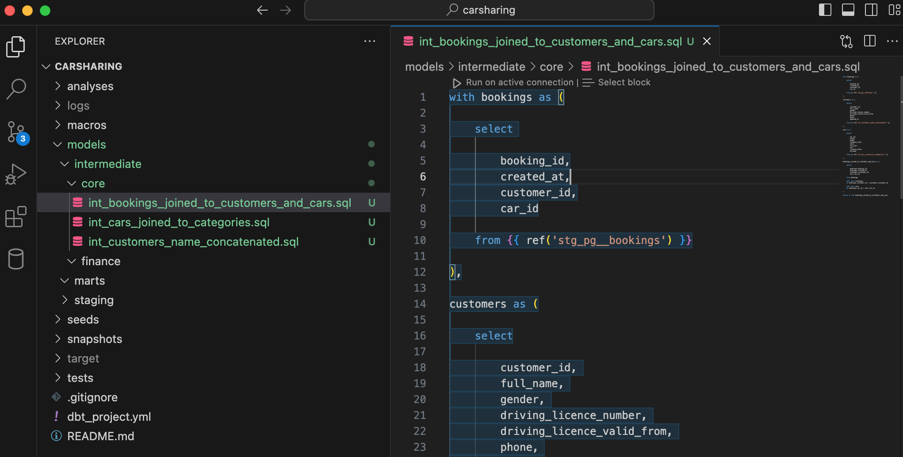
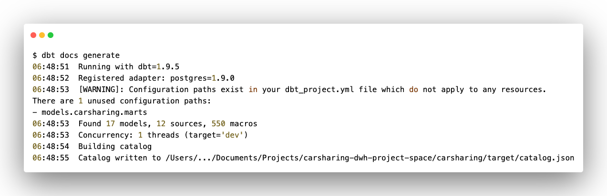
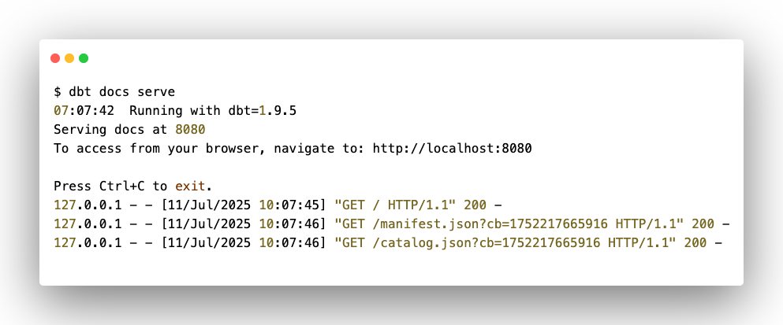
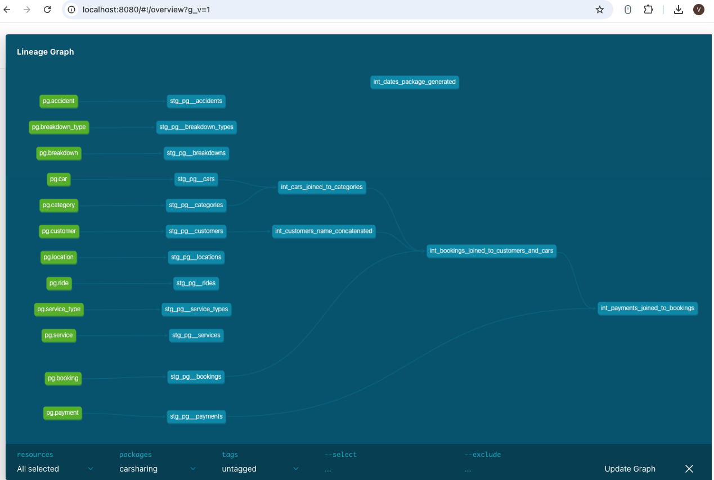

Перед тем, как перейти к созданию моделей вспомните подход к структурированию объектов промежуточного слоя и задачу учебного проекта.

Структура подпапок промежуточного слоя ориентирована на бизнес-структуру. Другими словами, если потребителями данных являются несколько подразделений компании, то в папке `intermediate` рекомендуется создать отдельные вложенные папки для хранения моделей для каждого из этих подразделений. В том случае, если имеются «общие» модели, которые используются всеми (или несколькими) подразделениями, то создайте для них отдельную вложенную в intermediate папку.

## Структура слоя

Исходя из задачи учебного проекта, создайте вложенные папки в  `intermediate`:

-  `core` – для хранения «общих» моделей,

-  `finance` – для хранения моделей финансового отдела.

## Модели слоя

### Общие модели

Одна из основных сущностей, которая может быть использована различными подразделениями компании – заказчики (customers). Сама данная сущность будет создана на слое витрин, а промежуточный слой – место для преобразования данных для этой сущности.

На staging-слое есть модель `stg_pg__customers.sql`, которая содержит отдельные поля с именами и фамилиями заказчиков – `first_name` и `last_name`. Но по отдельности такие поля в аналитике практически не используются. В связи с этим, выполните первое простое преобразование данных на промежуточном слое – объединение этих двух полей.

Напомню, что dbt-модели создаются с помощью обобщенных табличных выражений (CTE). В общем виде модель промежуточного слоя выглядит следующим образом:

```sql
with имя-cte as (

    select

        (перечень полей staging-модели)

    from {{ ref('имя-staging-модели') }}

)

select * from имя-cte
```

Создайте в папке `models/intermediate/core/` файл (в соответствие с правилами наименования) `int_customers_name_concatenated.sql` и добавьте код:

```sql
with customers as (

    select

        customer_id, 
        concat(first_name,' ',last_name) as full_name, 
        gender, 
        driving_licence_number, 
        driving_licence_valid_from, 
        phone, 
        email, 
        updated_at

    from {{ ref('stg_pg__customers') }}

)

select * from customers
```

{width=1892px height=946px}

Пусть это достаточно простой пример, но на нем вы увидели не менее простой принцип создания модели промежуточного слоя dbt-проекта.

Вторая общая сущность в платформе данных каршеринговой компании – автомобили (cars). В исходных данных к этой сущности можно отнести две таблицы – `car` (информация об автомобилях компании) и `category` (категория автомобилей – стандарт, комфорт, бизнес и т.д.).

Для создания обобщенной модели с данными об автомобилях обогатите данные таблицы `car` данными таблицы `category`.

Создайте в папке `models/intermediate/core/` файл (по правилами наименования) `int_cars_joined_to_categories.sql`.

Сделайте выборку данных из каждой staging-модели, а затем соедините:

```sql
with cars as (

    select 

        car_id, 
        brand, 
        model, 
        category_id, 
        car_year, 
        vin, 
        licence_plate, 
        mileage

    from {{ ref('stg_pg__cars') }}

),

categories as (

    select

        category_id, 
        category_text, 
        rate

    from {{ ref('stg_pg__categories') }}

), 

cars_joined_to_categories as (

    select

        cars.car_id, 
        cars.brand, 
        cars.model, 
        categories.category_text, 
        categories.rate,
        cars.car_year, 
        cars.vin, 
        cars.licence_plate, 
        cars.mileage

    from cars

    left join categories
    on cars.category_id = categories.category_id

)

select * from cars_joined_to_categories
```

{width=1860px height=1002px}

На промежуточном слое в качестве источников могут использоваться не только staging-модели, но и модели непосредственно промежуточного слоя. Примените эту идею в создании третьей общей сущности в платформе данных – бронирования (bookings). Как правило, бронирование содержит информацию о субъекте и объекте брони и будем считать эту сущность эквивалентом заказа. Применительно к учебному проекту модель бронирования должна быть представлена в разрезе заказчика и автомобиля.

Для создания этой модели используйте staging-модель с бронированиями, а также созданные на предыдущих шагах модели промежуточного слоя.

Создайте в папке `models/intermediate/core/` файл  `int_bookings_joined_to_customers_and_cars.sql` и добавьте следующий код:

```sql
with bookings as (

    select 

        booking_id,
        created_at,
        customer_id,
        car_id

    from {{ ref('stg_pg__bookings') }}

),

customers as (

    select

        customer_id, 
        full_name, 
        gender, 
        driving_licence_number, 
        driving_licence_valid_from, 
        phone, 
        email, 
        updated_at

    from {{ ref('int_customers_name_concatenated') }}

),

cars as (

    select 

        car_id, 
        brand, 
        model, 
        category_text, 
        rate,
        car_year, 
        vin, 
        licence_plate, 
        mileage

    from {{ ref('int_cars_joined_to_categories') }}

),

bookings_joined_to_customers_and_cars as (

    select

        bookings.booking_id,
        bookings.created_at,
        customers.customer_id, 
        cars.car_id

    from bookings

    left join customers
    on bookings.customer_id = customers.customer_id

    left join cars
    on bookings.car_id = cars.car_id

)

select * from bookings_joined_to_customers_and_cars
```

{width=2042px height=1034px}

С «общими» моделями разобрались. Пришло время модели финансового отдел, которая в конечном счете трансформируется в таблицу фактов.

### Модели финансового отдела

Итак, что наиболее важное для финансового отдела, в частности, каршеринговой компании? Скорее всего оплата бронирования (аренды) автомобиля. Но сама по себе оплата, или приход денежных средств, мало, о чем говорит. Хотя этого может быть и достаточно, но по условной задаче сотрудники финансового отдела желают проводить аналитическую работу. Так вот для детального анализа нужна привязка оплаты к субъекту и объекту. Другими словами, оплата должна быть предоставлена в разрезе заказчика и автомобиля.

Источниками для данной модели может быть staging-модель с данными по оплате и только что созданная промежуточная модель с информацией по бронированиям автомобилей.

Создайте в папке `models/intermediate/finance/` файл  `int_payments_joined_to_bookings.sql` и добавьте следующий код:

```sql
with payments as (

    select 

        payment_id, 
        created_at, 
        booking_id, 
        amount

    from {{ ref('stg_pg__payments') }}

),

bookings as (

    select

        booking_id, 
        created_at, 
        customer_id,
		car_id

    from {{ ref('int_bookings_joined_to_customers_and_cars') }}

),

payments_joined_to_bookings as(

    select 

        payments.payment_id, 
        payments.created_at, 
        bookings.customer_id,
        bookings.car_id, 
        payments.amount

    from payments

    left join bookings
    on payments.booking_id = bookings.booking_id

)

select * from payments_joined_to_bookings
```

{width=1974px height=976px}

### Модели для календаря

Помимо основных бизнес-сущностей в аналитике данных используется календарь для добавления разреза данных по различным временным периодам. В частности, в учебном проекте требуется добавить разрез по году, месяцу, неделе и дню. Существует несколько способов создания такого календаря, который в рамках хранилища станет измерением «Дата». Понятно, что данное измерение не относится к какому-то конкретному подразделению и может быть использовано в различных витринах. Но есть одна причина, по которой я вынес этот материал в отдельный раздел.

Итак, если говорить про dbt&trade; в части календаря, то можно пойти следующими путями:

-  загрузить вручную таблицу с нужными данными по календарю в папку `seeds` ([через csv-файл](./razvertyvanie-dbt-proekta#seeds)),

-  воспользоваться готовой библиотекой (в dbt&trade; они называются packages).

С точки зрения ознакомления с возможностями dbt&trade; второй вариант более интересный, поэтому в части создания календаря остановимся на нем.

#### dbt packages

Для начала несколько слов о dbt packages (или dbt библиотеках).

Что такое dbt package?

Возможно, это покажется невероятным, но это всего лишь обычный dbt-проект, который, как правило, хранится в git-репозитории. И «пакетом» он становится, когда импортируется в другой проект. Содержимое этих проектов (макросы, тесты, модели и т.д.) может быть переиспользовано в других проектах и позволяет избежать разработчикам «изобретения велосипеда».

Существует огромное количество полезных библиотек, созданных сообществом. Портал, где представлены библиотеки, называется [Package Hub](https://hub.getdbt.com). Там вы найдете библиотеку для решения практически всех задач.

Для наших целей импортируем одну из наиболее часто используемых библиотек `dbt-utils`.

#### dbt-utils

`dbt-utils` -- это библиотека, созданная непосредственно разработчиками dbt Labs. Она содержит широкий набор функций и макросов, которые помогают оптимизировать различные задачи в dbt-проектах. Но сейчас нам потребуется один из макросов, который работает с календарем. Этот макрос называется `date_spine`. Актуальная версия находится по ссылке <https://hub.getdbt.com/dbt-labs/dbt_utils/latest/>.

Пакеты импортируются очень просто, буквально в три шага (в первый раз, затем всего два шага).

Создайте файл `packages.yml` на том же уровне проекта, где расположен файл `dbt_project.yml`.

Добавьте в новый файл название «пакета» и его версию (посмотрите актуальную версию на странице библиотеки):

```yaml
packages:
  - package: dbt-labs/dbt_utils
    version: 1.3.0
```

"){width=1446px height=848px}

Для установки «пакета» выполните следующую команду:

```bash
dbt deps
```

{width=965px height=341px}

В результате установки пакетов в структуре проекта создается папка `dbt_packages` с вложенной папкой самой библиотеки (в данном случае `dbt_utils`).

<image src="./sozdanie-modeley-promezhutochnogo-sloya-intermed-7.png" title="Рисунок 29. Добавление в структуру проекта папки с библиотеками." crop="0,0,100,100" objects="square,4.838,22.0848,36.4461,7.5972,,top-left" width="1532px" height="932px"/>

Создайте в папке `models/intermediate/core/` файл  `int_dates_package_generated.sql` и добавьте код:

```sql
{{
	config(

		materialized='table'

    )
}}

with date_spine as (

	{{ dbt_utils.date_spine(
            datepart="day",
            start_date="cast('2023-01-01' as date)",
            end_date="cast('2024-01-01' as date)"
		)
	}}

),

calendar as (

	select

		date_day as date_id,
		date_day as full_date,
		extract(year from date_day) as year,
		extract(month from date_day) as month,
		extract(day from date_day) as day

	from date_spine

)

select * from calendar
```

<note type="lab" title="Примечание">

При [создании слоев ](./arkhitektura-dbt-proekta#создание-слоев-проекта)настройки материализации были выполнены в файле `dbt_project.yml`:

```yaml
intermediate:
      +materialized: view
```

Дело в том, что на уровне отдельной модели также можно выполнить конфигурацию `config()`, которая переписывает настройки проекта (в части конкретной модели). Для наглядности календарь материализован в виде таблицы в отличие от остальных моделей слоя.

</note>

Для создания календаря в `dbt_utils` существует макрос `date_spine`, которому нужно указать временной промежуток (`start_date` и `end_date`) для создания нужного аналитического разреза.

{width=1800px height=934px}

## Запуск проекта и обновление хранилища

Таким образом, вы подготовили промежуточные модели, которые будут использоваться для создания витрин. Это конечно же не все модели, которые можно создать на основе данных системы-источника. При желании вы можете создать дополнительные модели для сотрудников вымышленной компании Carsharing, а пока запустите движок dbt&trade;, чтобы создать объекты промежуточного слоя в хранилище.

Выполните команду запуска проекта:

```bash
dbt run
```

Перейдите в pgAdmin и проверьте результат:

<image src="./sozdanie-modeley-promezhutochnogo-sloya-intermed-9.png" title="Рисунок 31. Создание схемы для промежуточного слоя " crop="0,0,100,100" objects="square,5.9028,82.6531,18.4896,7.3469,,top-left" width="2088px" height="888px"/>

## Отслеживание связей между моделями

Уже на текущем этапе работы над проектом вы можете заметить, что даже в том небольшом количестве моделей, которые вы создали ранее, можно легко запутаться. Не так то просто проследить последовательность использования этих моделей.

Здесь на помощь приходит DAG (Directed Acyclic Graph) - направленный ациклический граф или линейный граф, который использует функции `source()` и `ref()` для определения связей между моделями.

DAG является частью функциональности dbt&trade; по автоматической генерации документации, с которой более подробно вы познакомитесь в отдельном разделе. Сейчас сфокусируйтесь именно на визуализации связей между моделями проекта.

Для создания документации по проекту выполните команду:

```bash
dbt docs generate
```

{width=1273px height=413px}

После выполнения данной команды в папке `target` создаются два файла - `catalog.json` (содержащий всю информацию о вашем проекте) и `index.html` (стартовая страница сайта с документацией).

<image src="./sozdanie-modeley-promezhutochnogo-sloya-intermed-11.png" title="Рисунок 33. Результат выполнения команды по созданию документации" crop="0,0,100,100" objects="square,9.9343,66.8845,29.5567,5.3377,,top-left&square,10.0985,81.4815,29.3924,4.793,,top-left" width="1218px" height="918px"/>

Но на этом еще не всё. «Из коробки» dbt&trade; позволяет сформировать документацию в виде локального статического сайта (запуск того самого `index.html`) по адресу <http://localhost:8080>.

Для этого выполните команду следующую команду:

```bash
dbt docs serve
```

{width=993px height=413px}

Можете немного ознакомиться со структурой сайта, но пока не будем вдаваться в подробности. Более детально рассмотрим документацию в [соответствующем разделе](./dokumentirovanie). Сейчас же сфокусируйтесь именно на линейном графе.

Нажмите на икону просмотра графика в правом нижнем углу.

<image src="./sozdanie-modeley-promezhutochnogo-sloya-intermed-13.png" title="Рисунок 35. Статический сайт с документацией к проекту" crop="0,0,100,100" objects="square,88.8889,86.4507,9.6521,11.6348,,top-left" width="891px" height="679px"/>

{width=1269px height=853px}

Перед вами текущее состояние всего проекта. На графе вы видите какие модели (вершины графа) сейчас используются и как они связаны между собой (ребра графа).

Для визуального удобства модели различных типов имеют соответствующую заливку. Например, на данном рисунке таблицы системы-источника окрашены в ярко-зеленый (или салатовый) цвет.

<note type="lab" title="Примечание">

dbt&trade; предоставляет возможность настройки пользовательской заливки. Эти настройки рассмотрены в разделе «[Документирование](./dokumentirovanie)».

</note>

Вы можете также проанализировать потоки данных (входящие и/или исходящие) для какой-то конкретной модели. Выполняется это в ячейке `-- select`.

Введите в `-- select` следующий текст `+int_cars_joined_to_categories+` и нажмите **Update Graph**. Плюс слева отобразит входящий поток в выбранную модель, а плюс справа – исходящий.

<image src="./sozdanie-modeley-promezhutochnogo-sloya-intermed-15.png" title="Рисунок 37. Анализ потока для конкретной модели" crop="0,0,100,100" objects="square,32.7545,50.3538,15.075,7.1934,,top-left" width="1267px" height="848px"/>

Таким образом, вы можете отслеживать связи между моделями проекта. На этом пока остановите знакомство с функциональностью документации и вернитесь к этому позднее.

Для отключения доступа к статическому сайту перейдите в терминал и нажмите `Ctrl+C`.

Пока же сохраните текущее состояние проекта.

## Сохранение проекта в GitHub

Загрузите текущее состояние вашего dbt-проекта в git-репозиторий.

Добавьте все файлы проекта:

```bash
git add .
```

Добавьте сообщение для коммита:

```bash
git commit -m "intermediate-models"
```

Отправьте локальный проект в репозиторий GitHub:

```bash
git push
```

Теперь актуальный код проекта хранится в GitHub-репозитории.