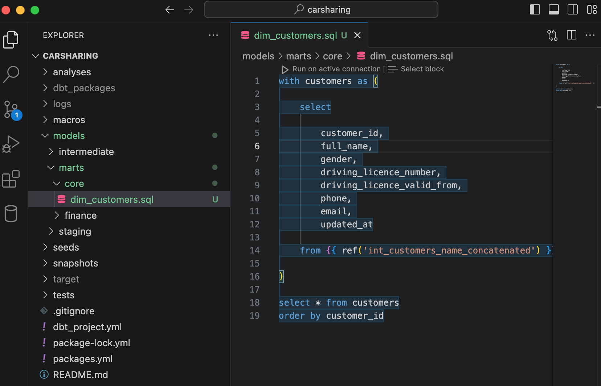
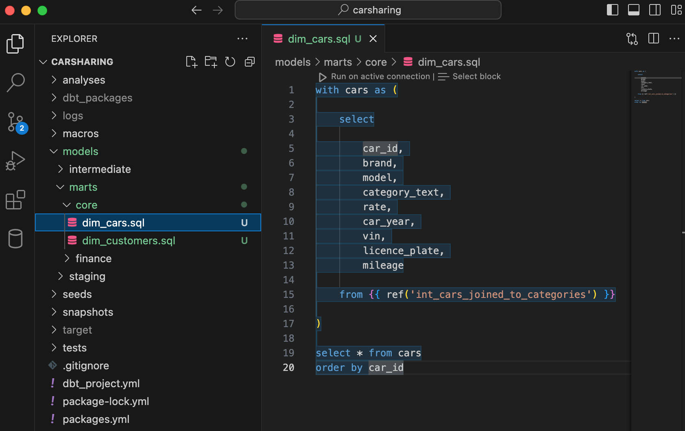
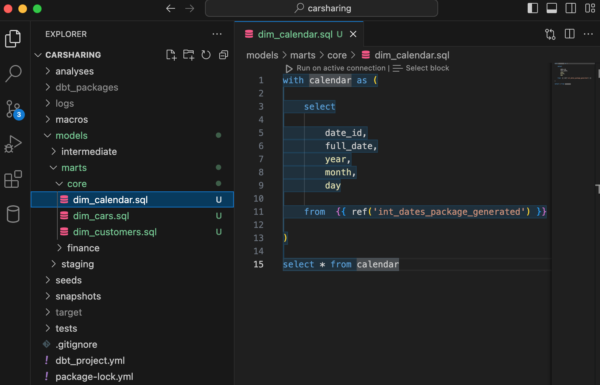
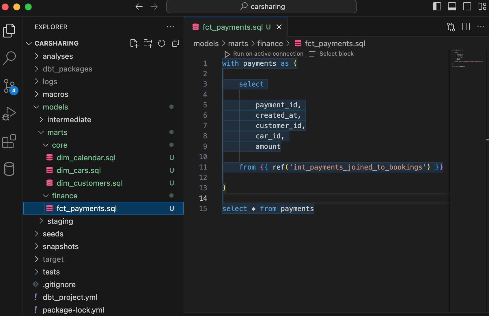

Структура папок слоя витрин данных повторяет структуру промежуточного слоя. Здесь создаются и хранятся как модели, ориентированные на конкретные бизнес-подразделения, так и модели, которые могут быть использованы несколькими подразделениями.

## Структура слоя

Создайте вложенные папки в  `marts`:

-  `core` – для хранения «общих» моделей,

-  `finance` – для хранения моделей финансового отдела.

## Модели слоя

### Общие модели

К этому моменту все необходимые преобразования  выполнены, поэтому остается лишь переложить итоговые модели промежуточного слоя в модели витрин.

Слой витрин данных для учебного проекта будет содержать четыре модели:

-  заказчики (customers),

-  автомобили (cars),

-  календарь (calendar)

-  оплата  (payments).

Начните с заказчиков.

Создайте в папке `models/marts/core/` файл `dim_customers.sql` и добавьте в него следующий код:

```sql
with customers as (

    select

        customer_id, 
        full_name, 
        gender, 
        driving_licence_number, 
        driving_licence_valid_from, 
        phone, 
        email, 
        updated_at

    from {{ ref('int_customers_name_concatenated') }}

)

select * from customers
order by customer_id
```

{width=1656px height=1066px}

В той же папке создайте файл `dim_cars.sql` и добавьте в него следующий код:

```sql
with cars as (

    select

        car_id, 
        brand, 
        model, 
        category_text, 
        rate, 
        car_year, 
        vin, 
        licence_plate, 
        mileage

    from {{ ref('int_cars_joined_to_categories') }}

)

select * from cars
order by car_id
```

{width=1684px height=1062px}

Создайте последнее измерение `dim_calendar.sql` и добавьте в него следующий код:

```sql
with calendar as (

	select

		date_id,
		full_date,
		year,
		month,
		day

	from  {{ ref('int_dates_package_generated') }}

)

select * from calendar
```

{width=1642px height=1054px}

### Модели финансового отдела

Осталось добавить последнюю модель с основной мерой (показателем) для финансового отдела.

Создайте в папке `models/marts/finance/` файл `fct_payments.sql` и добавьте в него следующий код:

```sql
with payments as (

    select 

        payment_id, 
        created_at, 
        customer_id,
        car_id, 
        amount

    from {{ ref('int_payments_joined_to_bookings') }}

)

select * from payments
```

{width=1694px height=1096px}

Поздравляю! Вы построили хранилище данных в парадигме Кимбалла с помощью dbt!

Теперь данные можно анализировать с помощью BI-инструментов. 