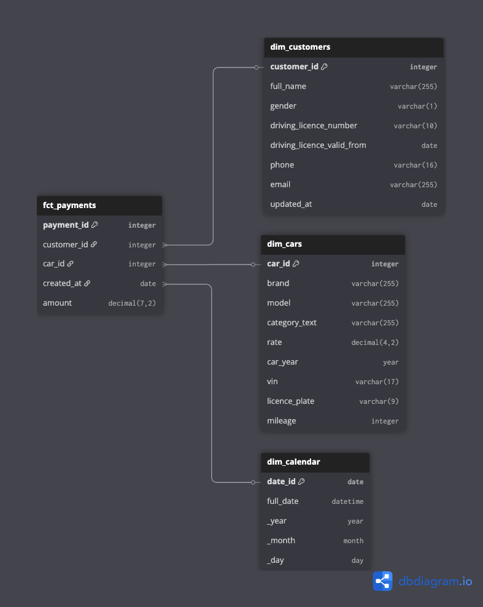

## **Описание**

Представьте, что перед вами поставлена задача по разработке хранилища данных для приложения каршеринговой компании Carsharing. Предполагается, что данные уже загружены в платформу и вам требуется организовать их согласно заданной архитектуре и преобразовать по требуемой бизнес-логике.

В результате выполнения учебного проекта вы подготовите витрины данных для финансового (или скорее финансово-аналитического) отдела компании.

*Таблица 1. Витрины данных учебного проекта*

| **Подразделение** | **Витрина** | **Примечание**                      |
|-------------------|-------------|-------------------------------------|
| Финансовый отдел  | Оплата      | Оплата за пользование автомобилем   |
| Все               | Заказчики   | Информация о клиентах               |
| Все               | Автомобили  | Информация об автомобилях парка     |
| Все               | Календарь   | Справочник дат в различных разрезах |

Созданные витрины могут быть использованы как различными BI-инструментами, так и запрошены напрямую через SQL.

<note type="lab" title="Примечание">

В данном руководстве приведен лишь один из вариантов реализации витрин. Вы вольны расширить их перечень на основании исходных данных.

</note>

## **Моделирование**

Существует несколько вариантов моделирования хранилищ - от популярного нынче DataVault (DV1 и DV2) до одной большой таблицы (OBT), или наоборот.

Годы работы с платформой SAP BW (Business Warehouse) не прошли для меня бесследно (к сожалению или счастью, сложно сказать). Так как основной подход моделирования хранилищ данных в SAP BW - модель Кимбалла (многомерная модель или dimensional model), то и учебный проект будет строится именно в этой парадигме с таблицами фактов и измерений.

То же самое касается витрин, так как модель Кимбалла предполагает, что для каждого конкретного бизнес-подразделения создается отдельная витрина данных, учитывающая потребности и особенности анализа этого конкретного подразделения.

### Определение таблиц фактов и измерений

На основе поставленной задачи требуется создать многомерную модель, которая будет показывать оплату в следующем аналитическом разрезе:

-  заказчики,

-  автомобили,

-  календарь (период - год, месяц, день).

{width=787px height=989px}