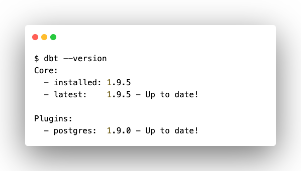

Раз уж было упомянуто программное обеспечение, то сразу выполните технологическую подготовку для работы над проектом.

## Рекомендованный способ

Чтобы сократить объем книги и не перепечатывать имеющуюся на просторах интернета информацию по установке требуемого программного обеспечения, остановлюсь лишь на установке dbt. Но вы внимательно пройдитесь по небольшому списку софта из предыдущего раздела и установите то, чего у вас пока нет.

Что касается dbt Core, то существует несколько способов его установки. Приведу рекомендованный разработчиком (dbt Labs) вариант.

<note type="lab" title="Примечание">

Для успешной установки dbt Core необходимо наличие на компьютере интерпретатора Python, а также Git.

</note>

Чтобы установить dbt Core на операционные системы Windows, Linux или MacOS используйте менеджер пакетов для Python - pip.

Откройте командную строку и выполните следующую команду:

```bash
python -m pip install --upgrade dbt-core
```

Или же обновите версию до последней, если dbt Core уже установлен:

```bash
python -m pip install --upgrade dbt-core
```

dbt может подключаться к различным платформам данных - базам, хранилищам и озерам данных. Для подключения к платформам используются плагины (или адаптеры), написанные на Python. При этом адаптеры бывают двух типов – доверенные (trusted) и версии сообщества (community).

## Доверенные адаптеры

Доверенные адаптеры созданы разработчиками компании dbt Labs и ее партнерами (Microsoft, Databricks и др.) в рамках программы Trusted Adapter Program, которая обязует разработчиков выполнять строгие требования по сопровождению и развитию соответствующих адаптеров.

Вот некоторые популярные платформы, с которыми интегрирован dbt через доверенные адаптеры:

-  Apache Spark

-  Athena

-  Azure Synapse

-  BigQuery

-  Databricks

-  IBM Netezza

-  Oracle Autonomous Database

-  Postgres

-  Redshift

-  Snowflake

-  Teradata

С полным актуальным перечнем доверенных адаптеров можно ознакомиться [в соответствующем разделе документации dbt.](https://docs.getdbt.com/docs/trusted-adapters)

## Адаптеры сообщества

Адаптеры версии сообщества – это плагины с открытым кодом, созданные и поддерживаемые членами сообщества dbt. Эти адаптеры могут не соответствовать требованиям, которые предъявляются к разработкам участников Trusted Adapter Program.

Некоторые примеры платформ данных, для которых возможность интерграции реализована сообществом:

-  Clickhouse

-  DuckDB

-  Hive

-  MySQL

-  Vertica

-  SQLite

Актуальный перечень адаптеров сообщества также находится [в соответствующем разделе документации dbt.](https://docs.getdbt.com/docs/community-adapters)

## Подключение адаптера

Подключение адаптера выполняется командой:

```bash
python -m pip install dbt-ADAPTER_NAME
```

, где `ADAPTER_NAME` – имя адаптера (плагина) в виде наименования платформы данных.

Так как в учебном проекте используется база данных PostgreSQL, то подключите соответствующий адаптер следующей командой:

```bash
python -m pip install dbt-postgres
```

После завершения установки плагина для PostgreSQL проверьте версию dbt. Для это выполните команду:

```bash
dbt --version
```

{width=599px height=341px}

<note type="lab" title="Примечание">

Также существует возможность одновременно установить dbt Core и нужный плагин с помощью команды (вместо dbt-ADAPTER_NAME укажите нужный плагин):

```bash
python -m pip install dbt-core dbt-ADAPTER_NAME
```

</note>

На этом установка dbt Core закончена. Поздравляю! Первый шаг успешно выполнен.

Теперь потребуется развернуть dbt-проект. 

Но для начала сориентирую по задаче, которую нужно будет решить в рамках учебного проекта.