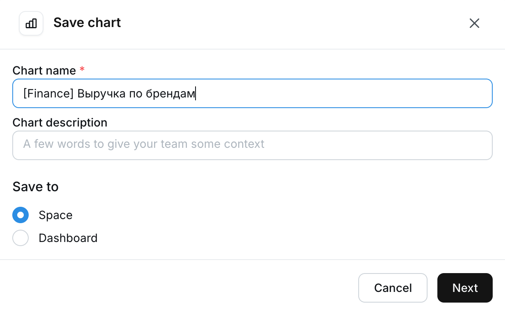
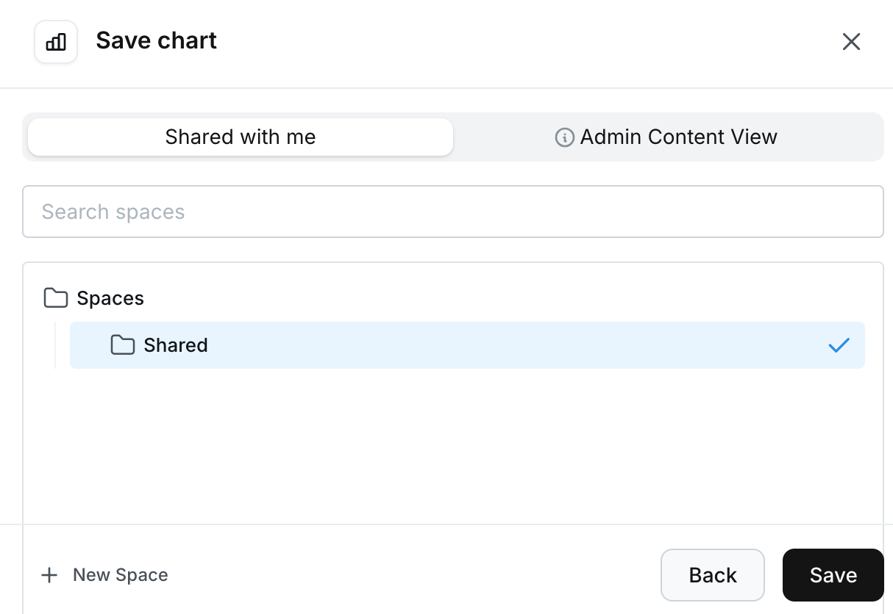
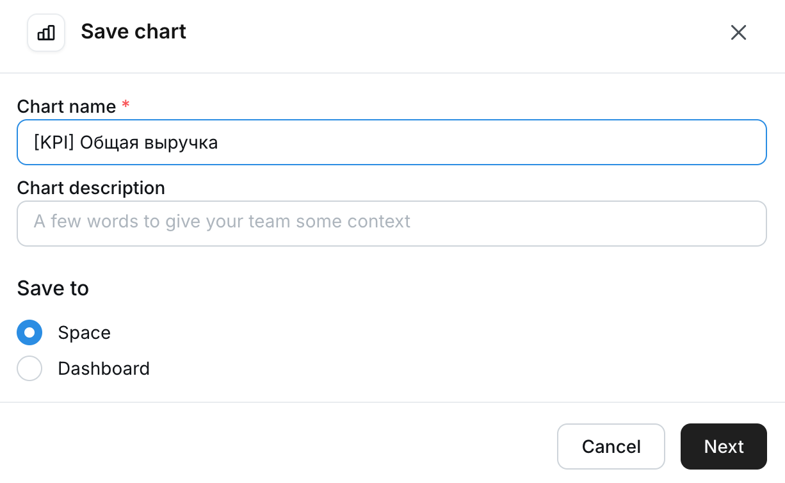
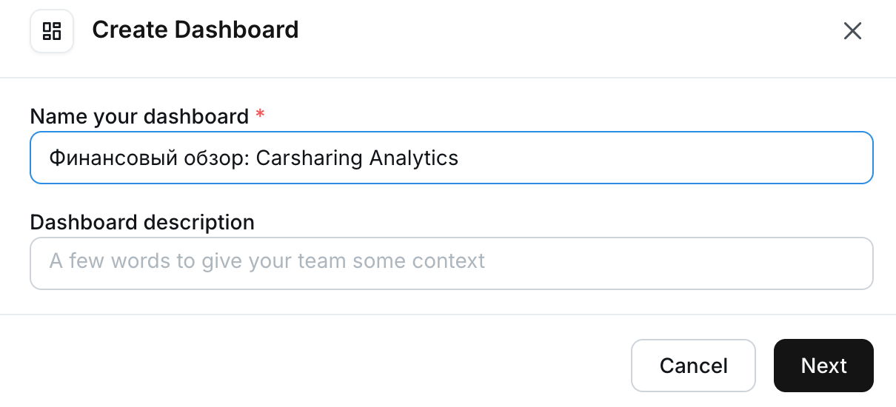
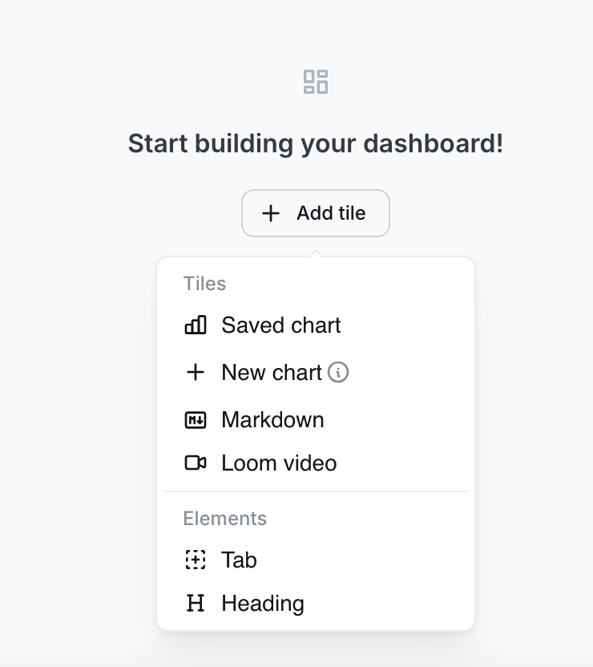
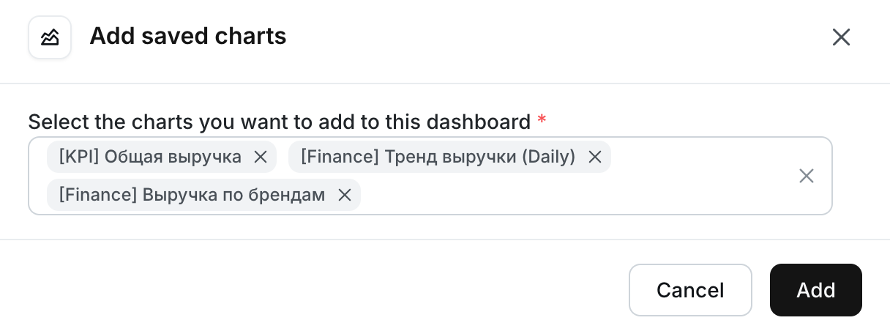
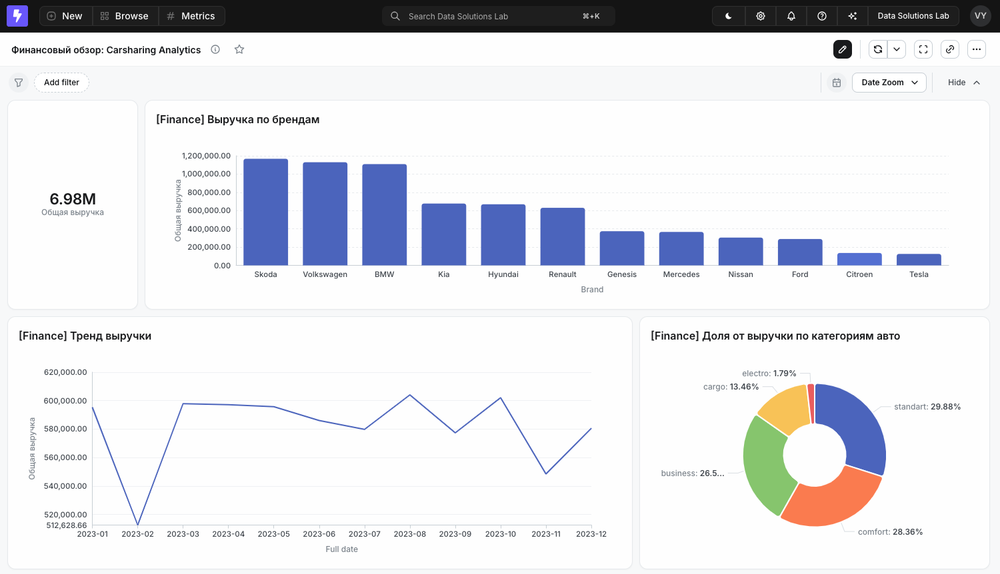

После завершения работ на стороне «бэкэнда» - реализация хранилища, настройка трансформации данных, автоматизация задач dbt Core - логично перейти  к этапу, который бизнес-пользователи видят первым (и пожалуй, единственным)  - к визуализации или «фронту» нашей аналитической системы. Сначала я хотел описать в этом разделе  такие инструменты как Apache Superset, Yandex Datalens и некоторые другие варианты, с помощью какого-то из этих инструментов построить тестовый дашборд для проекта. Но в последнее время меня очень заинтересовал более «инженерный» подход -- BI-as-Code, который достаточно быстро набирает обороты в профессиональной аналитике.

## Почему классический BI  не эффективен?

Аналитика часто существует в каком-то раздвоенном состоянии - инженеры создают надежные модели в dbt™ и хранят их в Git, а потом аналитики вручную настраивают метрики и связи внутри BI-инструментов (Tableau, Power BI, Superset и т.д.). Порой это приводит к некоторым проблемам (*возможно, не всегда, но потенциальный риск существует*):

1. **Двойная работа**: зачастую приходится описывать связи между таблицами дважды - сначала для базы данных, потом для визуализации.

2. **Расхождение данных**: метрики, настроенные кликами в BI-инструментах, со временем начинают отличаться от тех, что прописаны в коде DWH.

3. **Отсутствие версионирования**: изменения в дашбордах нельзя «откатить» или проверить через Pull Request.

## Концепция BI-as-Code и семантический слой

Подход BI-as-Code (*еще встречалось определение Headless BI*) позволяет устранить обозначенные проблема. Логика метрик переносится из интерфейса BI-инструмента непосредственно в код dbt-проекта. Теперь определение метрик или каких-то показателей в таком подходе можно определять в YAML-файлах. Это превращает ваш dbt-проект в «семантический слой» - единый источник правды всей системы, который диктует BI-инструменту, как именно нужно агрегировать данные. Одним из таких инструментов является [Lightdash](https://www.lightdash.com/).

### Lightdash - визуализация для dbt-проекта

В контексте учебного проекта Carsharing, где dbt™ является, скажем так, основным инструментом, выбор Lightdash выглядит наиболее естественным и эффективным.

Основная концепция Lightdash - «BI поверх dbt». Этот инструмент работает полностью на dbt-проекте, считывая его метаданные.

Например, при добавлении нового поля в dbt-модели, оно мгновенно появляется в Lightdash. Также можно добавить описание новой метрики в коде и бизнес-пользователь (или аналитик) сразу увидит ее и сможет использовать при построении дашбордов или отчетов.

В этом разделе посмотрим, как создать простой дашборд с помощью Lightdash. Но не будем касаться темы развертывания этого инструмента. Вкратце лишь расскажу о возможных вариантах.

## Развертывание и подключение Lightdash

Поскольку Lightdash - это open-source решение, то у нас, как у его пользователей, есть некоторая гибкость в выборе способа развертывания.

Рассмотрим два основных сценария.

### 1\. Lightdash Cloud (SaaS)

Это самый простой и быстрый способ познакомиться с инструментом. Вам не нужно настраивать серверы или следить за обновлениями -- команда разработчиков Lightdash делает это за вас.

-  **Плюсы**: запуск за \~5 минут, бесплатный уровень для небольших команд, автоматические бэкапы.

-  **Минусы**: данные визуализации покидают ваш контур. Если ваша база данных  закрыта файрволом, то придется настраивать доступ для IP-адресов Lightdash Cloud.

### 2\. Self-hosted (Docker)

Развертывание Lightdash на собственной виртуальной машине (локально или в облаке) с помощью Docker Compose.

-  **Плюсы**: полный контроль над данными и безопасностью. BI-движок находится в той же виртуальной сети (VPC), что и база данных. Это позволяет обмениваться трафиком, минуя публичный интернет.

-  **Минусы**: требует навыков администрирования Linux и Docker, а также самостоятельного управления ресурсами сервера.

Для своего проекта я создал виртуальную машину в Yandex Cloud и там развернул Lightdash. Но в рамках текущего руководства не буду описывать инфраструктурные активности, а остановлюсь только на работе непосредственно в BI-инструменте. Итак, считаем, что Lightdash развернут. Но прежде, чем мы в него перейдем и начнем создавать дашборд, выполним дополнительные настройки в текущем dbt-проекте.

## Семантика в dbt-проекте

Чтобы Lightdash увидел ваши данные и превратил их в удобные «кубики» для аналитика или бизнес-пользователя, не нужно ничего настраивать в самом интерфейсе BI. Всё описание таблиц, связей и правил агрегации происходит в YAML-файлах  dbt-проекта.

Для Lightdash dbt-проект -- это не просто набор SQL-запросов, а семантический слой. Чтобы Lightdash понял структуру данных, связи между таблицами и логику расчета показателей, нужно дополнить некоторые существующие настроечные файлы проекта специальными метаданными, а также создать новый конфигурационный файл. Вот с него и начнем.

### Фильтрация витрин

По умолчанию Lightdash пытается импортировать всё, что найдет. Но бизнес-пользователю не нужно видеть весь проект, например, промежуточные таблицы или staging-слой. Для этого необходимо явно указать Lightdash смотреть только в папку `marts`. Таким образом, в интерфейсе для анализа будут доступны только финальные витрины (`dim_` и `fct_`), что создаст чистое рабочее пространство для  аналитика или бизнес-пользователя.

В корне dbt-проекта  создайте файл `.lightdash.yml`, добавьте следующий код и сохраните:

```yaml
version: 1
projects:
  - name: Carsharing Analytics
    dbt_project_dir: .
    models:
      - "marts/**"
```

Это основной конфигурационный файл Lightdash. Пройдемся по нему подробнее:

-  `version: 1` - текущая версия схемы конфигурации Lightdash. Обязательный параметр, который гарантирует, что движок Lightdash будет интерпретировать последующие команды корректно. На данный момент используется версия `1`.

-  `projects` - список  проектов. В одном репозитории теоретически могут быть несколько dbt-проектов, поэтому в этом разделе перечисляются эти аналитического пространства (проекты).

-  `name: Carsharing Analytics` - имя проекта, которое будет отображаться в интерфейсе Lightdash (в выпадающем списке проектов).

-  `dbt_project_dir: .` - путь к папке с dbt-проектом (относительно корня репозитория). Точка ( `.` ) означает, что файл `dbt_project.yml` лежит в той же папке, что и текущий конфиг (`.lightdash.yml`).  Lightdash использует этот параметр, чтобы найти основные настройки dbt-проекта.

-  `models:` - список фильтров (селекторов) для моделей. Данный параметр определяет, какие именно dbt-модели Lightdash должен импортировать и превратить в таблицы для анализа.

-  `"marts/**"` - путь с маской, которая  дает команду: «Сканируй только папку `marts` и все её подпапки ( `/` )». В dbt-проекте, с точки зрения бизнес-пользователя или аналитика,  много «технических» слоев (например, `staging`, `intermediate`). Если не указать этот параметр, Lightdash заберет в интерфейс все таблицы и может запутать «не технических» специалистов. Данный параметра гарантирует, что в BI будут доступны только таблицы витрин  (например, `fct_payments` или `dim_cars`), а все остальные объекты останутся видны только инженерам в исходном проекте.

### Описание измерений (Dimensions) в справочниках

Ранее в файле `_dimensions__models.yml` вы описывали справочники проекта. Казалось бы, dbt™ и так обладает всей информацией  о колонках, но для BI важны дополнительные детали.

Для id полей общих справочников на уровне витрин (`core`), которые в дальнейшем будут соединяться с витриной `finance` нужно указать тип измерения. В противном случае числовые id Lightdash может воспринять как показатели и попытаться их просуммировать. Указывая `type: string`, мы обозначим Lightdash, что это просто уникальный идентификатор, его нельзя складывать. Дополнительно для `dim_calendar` нужно будет указывать `type: date`. Это позволяет Lightdash автоматически генерировать фильтры (например, «прошлый месяц» или «текущий год») и строить иерархии времени.

Откройте файл `_dimensions__models.yml` и обновите его следующим содержанием (комментарий «*\# Обновление*»):

```yaml
version: 2

models:
  - name: dim_customers
    columns:
      - name: customer_id
        meta: # Обновление
          dimension: # Обновление
            type: string # Обновление 
        tests:
          - unique
          - not_null

  - name: dim_cars
    description: Справочник автомобилей
    columns:
      - name: car_id
        description: '{{ doc("car_id") }}'
        meta: # Обновление
          dimension: # Обновление
            type: string # Обновление
        tests:
          - unique
          - not_null
      - name: category_text
        description: Категория автомобиля
        tests:
          - accepted_values:
              arguments:
                values: ['business', 'cargo', 'comfort', 'electro', 'standart']
      - name: brand 
        description: Марка автомобиля
      - name: model 
        description: Модель автомобиля
      - name: rate
        description: Тариф аренды автомобиля 
      - name: car_year
        description: Год выпуска
      - name: vin 
        description: VIN номер
      - name: licence_plate 
        description: Государственный регистрационный номер
      - name: mileage
        description: Пробег (км)

  - name: dim_calendar
    columns:
      - name: date_id
        meta: # Обновление
          dimension: # Обновление
            type: string # Обновление
        tests:
          - unique
          - not_null
      - name: full_date 
        meta: # Обновление
          dimension: # Обновление
            type: date # Обновление
```

### Формирование связей и метрик

Файл `_finance__models.yml` является «сердцем» семантического слоя проекта. Здесь будет происходить магия превращения плоских таблиц в аналитический куб. В классических BI-инструментах пришлось бы тянуть стрелочки между таблицами. В Lightdash эти действия выполняются в блоке `meta` модели фактов. Так как в учебном проекте витрины  финансово-аналитического отдела состоят из трех справочников (`dim_customers`, `dim_cars`, `dim_calendar`) и таблицы фактов (`fct_payments`), то их необходимо связать друг с другом.

Откройте файл `_finance__models.yml` и для модели `fct_payments` добавьте следующие строки в блоке `meta`:

```yaml
version: 2

models:
  - name: fct_payments
    description: Оплата за пользование автомобилем 
    meta: # Обновление
      joins: # Обновление
        - join: dim_customers # Обновление
          sql_on: ${fct_payments.customer_id} = ${dim_customers.customer_id} # Обновление
        - join: dim_cars # Обновление
          sql_on: ${fct_payments.car_id} = ${dim_cars.car_id} # Обновление
        - join: dim_calendar # Обновление
          sql_on: CAST(${fct_payments.created_at} AS DATE) = ${dim_calendar.full_date} # Обновление
...
```

Вы только что создали связи между справочниками и таблицей фактов по соответствующим id. Теперь, выбрав таблицу платежей, аналитик или бизнес-пользователь сможет «провалиться» в характеристики машин или данные клиентов, не написав ни строчки SQL-кода. Lightdash сам подставит нужный Join в запрос.

Теперь перейдем, пожалуй, к самой важной части BI-as-Code. Необходимо перенести формулы расчетов метрик из «головы аналитика» в код. Допустим у нас будут следующие метрики:

-  количество платежей,

-  общая выручка,

-  средний чек.

Добавьте в открытый файл `_finance__models.yml` следующее содержание (комментарий «*\# Обновление*»):

```yaml
...
columns:
      - name: payment_id
        description: Идентификатор оплаты
        meta: # Обновление
          dimension: # Обновление
            type: string # Обновление
          metrics: # Обновление
            payment_count: # Обновление
              type: count # Обновление
              label: "Кол-во платежей" # Обновление
        tests:
          - unique
          - not_null    

      - name: amount
        description: Сумма оплаты
        meta: # Обновление
          dimension: # Обновление
            type: number # Обновление
          metrics: # Обновление
            total_revenue: # Обновление
              type: sum # Обновление
              label: "Общая выручка" # Обновление
              round: 2 # Обновление
            avg_payment: # Обновление
              type: average # Обновление
              label: "Средний чек" # Обновление
              round: 2 # Обновление
        tests:
          - check_positive_values

      - name: created_at 
        description: Дата произведения оплаты
        meta: # Обновление
          dimension: # Обновление
            type: timestamp # Обновление
...
```

Раздел файла `columns` в dbt-проекте превращается в список доступных полей в BI. Разберем эти поля.

#### payment_id (Идентификатор оплаты)

-  `meta: dimension: type: string` - по аналогии с измерениями нужно явно указать тип данного поля в виде строки, чтобы Lightdash не «суммировал» идентификаторы.

-  `meta: metrics:` - начало описания расчетных показателей.

   -  `payment_count:` - техническое имя метрики,

   -  `type: count` - Lightdash превратит эту метрику в `COUNT(payment_id)`,

   -  `label: "Общая выручка"` - название метрики, которое увидят бизнес-пользователи в списке полей.

#### amount (Сумма оплаты)

-  `meta: metrics:` - начало описания расчетных показателей.

   -  `total_revenue:` - техническое имя метрики,

   -  `type: sum` - Lightdash обернет поле в `SUM(amount)`,

   -  `label: "Общая выручка"` - название метрики, которое увидят бизнес-пользователи в списке полей.

   -  `round: 2` - автоматическое округление до сотых на уровне визуализации,

   -  `avg_payment:` - вторая метрика для того же поля, которая превратится в `AVG(amount)`.

#### created_at (Дата призведения оплаты)

-  `meta: dimension: type: timestamp` - Lightdash автоматически создаст для этого поля иерархию (день, неделя, месяц, год), что позволит строить тренды одной кнопкой в интерфейсе BI.

Добавьте также тип измерения для всех оставшихся полей. Окончательный вид файла `_finance__models.yml`:

```yaml
version: 2

models:
  - name: fct_payments
    description: Оплата за пользование автомобилем 
    meta: # Обновление
      joins: # Обновление
        - join: dim_customers # Обновление
          sql_on: ${fct_payments.customer_id} = ${dim_customers.customer_id} # Обновление
        - join: dim_cars # Обновление
          sql_on: ${fct_payments.car_id} = ${dim_cars.car_id} # Обновление
        - join: dim_calendar # Обновление
          sql_on: CAST(${fct_payments.created_at} AS DATE) = ${dim_calendar.full_date} # Обновление

    columns:
      - name: payment_id
        description: Идентификатор оплаты
        meta: # Обновление
          dimension: # Обновление
            type: string # Обновление
          metrics: # Обновление
            payment_count: # Обновление
              type: count # Обновление
              label: "Кол-во платежей" # Обновление
        tests:
          - unique
          - not_null    

      - name: amount
        description: Сумма оплаты
        meta: # Обновление
          dimension: # Обновление
            type: number # Обновление
          metrics: # Обновление
            total_revenue: # Обновление
              type: sum # Обновление
              label: "Общая выручка" # Обновление
              round: 2 # Обновление
            avg_payment: # Обновление
              type: average # Обновление
              label: "Средний чек" # Обновление
              round: 2 # Обновление
        tests:
          - check_positive_values

      - name: created_at 
        description: Дата произведения оплаты
        meta: # Обновление
          dimension: # Обновление
            type: timestamp # Обновление

      - name: customer_id
        description: Идентификатор заказчика (арендатора)
        meta: # Обновление
          dimension: # Обновление
            type: string # Обновление

      - name: car_id 
        description: '{{ doc("car_id") }}'
        meta: # Обновление
          dimension: # Обновление
            type: string # Обновление

      - name: cash_inflows
        description: "Классификация платежа по сумме (small/medium/large)"
        meta: # Обновление
          dimension: # Обновление
            type: string # Обновление
            label: "Сегмент платежа" # Обновление
```

<note type="lab" title="Примечание">

Подробное описание всех типов метрик (count, sum, average и др.) и доступных параметров для их тонкой настройки в YAML-файлах можно найти в официальной документации: [**Lightdash: Adding metrics to your project**](https://docs.lightdash.com/references/metrics)

</note>

<image src="./vizualizaciya-dannykh.png" title="Рисунок 80. Настройки dbt-проекта для Lightdash" crop="0,0,100,100" objects="square,4.4214,91.25,25.9825,4.1964,,top-left&square,4.476,32.9464,25.3821,4.0179,,top-left&square,4.3668,52.2321,25.0546,4.2857,,top-left" width="1832px" height="1120px" float="center"/>

## Сохранение проекта в GitHub

Загрузите измененные файлы проекта в git-репозитрий:

```bash
git add .
```

Добавьте сообщение для коммита:

```bash
git commit -m "lightdash"
```

Отправьте локальный проект в репозиторий GitHub:

```bash
git push
```

Теперь актуальный код проекта хранится в GitHub-репозитории.

## Генерация токена GitHub

Забегая немного вперед, скажу, что dbt-проект в Lightdash будет подтягиваться из GitHub-репозитория (в моем случае именно GitHub, у вас могут быть другие варианты). Для подключения и дальнейшей автоматизации обновления данных в Lightdash нужно будет указать персональный токен разработчика.

Для получения токена войдите в свою учетную запись GitHub, перейдите в настройки профиля (**Settings**) и затем откройте настройки разработчика (**Developer Settings**):

<image src="./vizualizaciya-dannykh-6.png" title="Рисунок 81. Настройки разработчика (Developer Settings) в GitHub" crop="0,0,100,100" objects="square,2.0713,24.2647,21.7067,19.3015,,top-left" width="1207px" height="544px" float="center"/>

В выпадающем меню **Personal access tokens** выберите **Tokens (classic)**. Выполните генерацию нового токена - нажмите **Generate new token** -> **Generate new token (classic)**:

<image src="./vizualizaciya-dannykh-7.png" title="Рисунок 82. Выбор варианта токена" crop="0,0,100,100" objects="square,61.2635,14.2857,24.9377,30.9859,,top-left" width="1203px" height="497px" float="center"/>

Введите имя токена (при необходимости выберите подходящую опцию срока действия токена), поставьте галочку для **repo** и сгенерируйте токен:

<image src="./vizualizaciya-dannykh-9.png" title="Рисунок 83. Генерация персонального классического токена" crop="0,0,100,100" objects="square,25.9816,30.8231,36.3409,30.648,,top-left&square,26.0652,71.1033,18.9641,7.3555,,top-left" width="1197px" height="571px" float="center"/>

Теперь можно переходить к настройке Lightdash.

## Настройка Lightdash

Теперь пришло время поработать в BI (варианты развертывания были описаны в [одном из предыдущих разделов](./vizualizaciya-dannykh#развертывание-и-подключение-lightdash)). Первым делом создайте учетную запись администратора. Конечно же хорошим тоном является создание отдельных учетных записей с различными полномочиями для админов, разработчиков, аналитиков и т.д. Но в рамках учебного проекта будем использовать одну учетную запись. На самом первом экране укажите имя, фамилию, email и пароль.

<image src="./vizualizaciya-dannykh-5.png" title="Рисунок 84. Создание учетной записи в Lightdash" crop="0,7.597173144876325,99.9927953148962,92.40282685512368" width="1756px" height="1310px" float="center"/>

Далее введите название организации (или имя проекта), а также выберите свою роль:

<image src="./vizualizaciya-dannykh-4.png" title="Рисунок 85. Создание учетной записи в Lightdash" crop="0,7.773851590106007,99.94199358876507,92.226148409894" width="2120px" height="1172px" float="center"/>

Существуют два варианта загрузки dbt-проекта в Lightdash:

1. с помощью CLI Lightdash,

2. через загрузку git-репозитория.

Второй мне кажется более удобным, так как позволит автоматизировать обновление. Данные будут подтягиваться в Lightdash при каждом push в git-репозиторий. 

<image src="./vizualizaciya-dannykh-3.png" title="Рисунок 86. Варианты загрузки dbt-проекта в Lightdash" crop="0,7.9787234042553195,100,92.02127659574468" objects="square,31.2324,65.3179,37.9116,14.0655,,top-left" width="1063px" height="564px" float="center"/>

Выберите источник данных (хранилище данных в учебном проекте построено на PostgreSQL) и укажите параметры соединения к нему:

<image src="./vizualizaciya-dannykh-2.png" title="Рисунок 87. Подключение к хранилищу (PostgreSQL)" crop="0,7.06713780918728,99.8965160400138,92.93286219081273" width="1058px" height="661px" float="center"/>

Теперь пришло время подключить dbt-проект. Здесь как пригодится токен, который вы сгенерировали ранее. Укажите следующую информацию:

-   тип подключения (GitHub);

-   метод авторизации (Personal Access Token);

-  значение токена;

-  репозиторий, в котором хранится код проекта;

-  ветку (обычно main).

<image src="./vizualizaciya-dannykh-8.png" title="Рисунок 88. Подключение к GitHub-репозиторию с dbt-проектом" crop="0,7.243816254416961,99.89794080566729,92.75618374558304" width="1059px" height="658px" float="center"/>

После указания параметров соединения проект будет добавлен в Lightdash. Ранее в настроечном файле `.lightdash.yml` вы обозначили, чтобы в BI ушли модели только слоя витрин (`marts/**`). Но при импорте проекта вы можете дополнительно ограничить их перечень.  Делается это через опцию **Show models in this list**. Так как в учебном проекте витрина не так много, то укажите все четыре и сохраните изменения (**Save changes**).

<image src="./vizualizaciya-dannykh-10.png" title="Рисунок 89. Выбор моделей для работы в Lightdash" crop="0,7.420494699646643,99.9245615670851,92.57950530035336" width="1065px" height="654px" float="center"/>

Половина дела сделана! Соединение с базой настроено, проект добавлен. Теперь порешаем BI-задачи. Запустите запрос к хранилищу, нажмите **Run your first query**.

<image src="./vizualizaciya-dannykh-11.png" title="Рисунок 90. Запуск первого запроса" crop="0,7.017543859649122,100,92.98245614035088" objects="square,39.868,78.7307,19.7926,9.0909,,top-left" width="1061px" height="627px" float="center"/>

В списке таблиц из **Fct payments** и выберите метрику **Общая выручка**, а из **Dim cars** - **Brand**:

<image src="./vizualizaciya-dannykh-12.png" title="Рисунок 91. Формирование аналитического разреза по бренду (марке)" crop="0,6.927710843373494,100,93.07228915662651" width="1062px" height="664px" float="center"/>

Запустите выборку данных, нажмите **Run query**:

<image src="./vizualizaciya-dannykh-13.png" title="Рисунок 92. Выборка общей выручки по бренду (марке)" crop="0,6.906906906906906,100,93.09309309309309" width="1054px" height="666px" float="center"/>

Данные успешно запрошены из хранилища. Нажмите **Chart** для выбора подходящей визуализации этого разреза данных. По умолчанию подтягивается столбчатая диаграмм, которая вполне здесь уместна. Тем не менее вы можете изменить отображение через настройки. Нажмите **Configure**:

<image src="./vizualizaciya-dannykh-14.png" title="Рисунок 93. Выборка общей выручки по бренду (марке)" crop="0,0,100,100" objects="square,32.9861,29.9517,9.5486,6.2802,,top-left&square,85.3733,29.9517,9.9826,6.8599,,top-left" width="2520px" height="1132px" float="center"/>

Через **Chart type** вы можете выбрать вариант визуализации и в целом в разделе **Configure chart** также можете произвести нужные настройки. После того, как график готов нажмите **Save chart**:

<image src="./vizualizaciya-dannykh-15.png" title="Рисунок 94. Настройки диаграммы с выручкой по брендам" crop="0,7.174490699734277,100,92.82550930026572" width="2514px" height="1232px" float="center"/>

В модальном окне сохранения обязательно укажите название графика/диаграммы (**Chart name**) и опционально краткое описание (**Chart description**): 

{width=1232px height=762px}

Все артефакты проекта лучше сохранять в едином месте, так называемом, пространстве (**Space**). По умолчанию при сохранении предлагается пространство **Shared**, но вы можете создать новое: 

{width=1214px height=836px}

В итоге получилась диаграмма, которую можно использовать отдельно, а также переиспользовать в дашбордах.

<image src="./vizualizaciya-dannykh-18.png" title="Рисунок 97. Столбчатая диаграмма \"Выручка по брендам\"" crop="0,6.567425569176883,99.95848673957575,93.43257443082311" width="2518px" height="1252px" float="center"/>

Создайте новый «виджет» с суммарной выручкой компании Carsharing. Из таблицы **Fct payments** и выберите метрику **Общая выручка**, а в качестве визуализации **Chart type** - **Big value** (его можно применять для отображения различных KPI):

<image src="./vizualizaciya-dannykh-19.png" title="Рисунок 98. Выборка с общей выручкой" crop="0,6.129597197898424,99.99214167839462,93.87040280210157" width="2524px" height="1318px" float="center"/>

Для более приятного и компактного отображения значения суммы выберите в настройках формат «миллионы» - **Format: millions (M)**.

<image src="./vizualizaciya-dannykh-20.png" title="Рисунок 99. Настройка формата для больших сумм" crop="0,7.168458781362006,100,92.831541218638" objects="square,0.3418,53.1017,29.248,11.728,,top-left" width="2522px" height="1222px" float="center"/>

Дайте имя нового графику и сохраните его:

{width=1226px height=754px}

Аналогичным образом добавьте еще два «виджета»:

-  линейный график с трендом выручки по месяцам;

-  круговую диаграмму с долями выручки по категориям автомобилей.

После создания графиков и диаграмм с нужными аналитическими разрезами объедините их в дашборде. Создайте новый артефакт проекта **Dashboard**:

<image src="./vizualizaciya-dannykh-25.png" title="Рисунок 101. Создание дарборда" crop="0,12.652439024390244,100,87.34756097560977" width="832px" height="656px" float="center"/>

Укажите имя дашборда и описание (опционально):

{width=1210px height=550px}

Добавьте сохраненные графики и диаграммы, нажмите **Add tile** -> **Saved chart**:

{width=740px height=832px}

В Lightdash реализован очень удобный механизм добавления графиков. Можно добавить сразу несколько элементов. Перечислите созданные ранее артефакты:

{width=1216px height=456px}

Расположите все элементы в подходящем порядке для оптимальной и удобной работы с данными.

Таким незамысловатым способом можно визуализировать данные dbt-проекта. Понятно, что в учебном проекте реализован достаточно просто вариант, но на нем вы рассмотрели основные принципы и подходы разработки полноценной аналитической системы.

{width=1500px height=862px}

## Что дальше?

Теперь, помимо основной функциональности dbt Core, вы имеете представление об оркестрации задач и можете не только автоматизировать преобразование данных, но и визуализировать их для принятия управленческих решений.

Смело продолжайте детально разбираться с dbt Core и другими инструментами, упомянутыми в руководстве. Небольшой [перечень дополнительных ресурсов](./dopolnitelnye-resursy) поможет вам сделать следующий шаг в этом направлении.